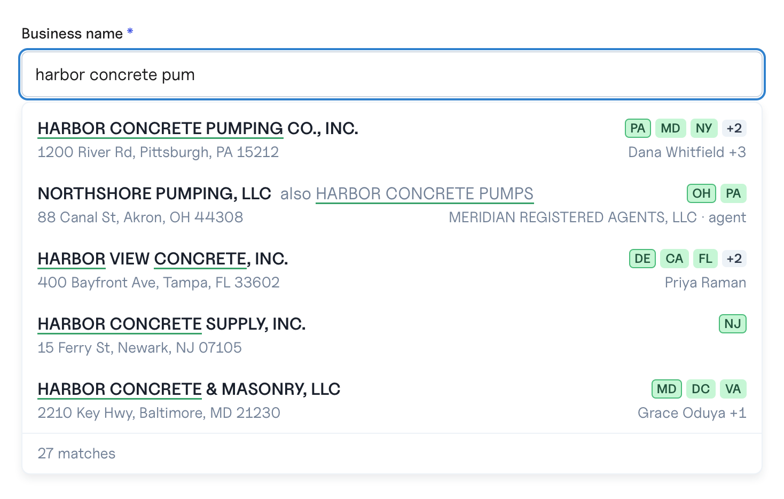
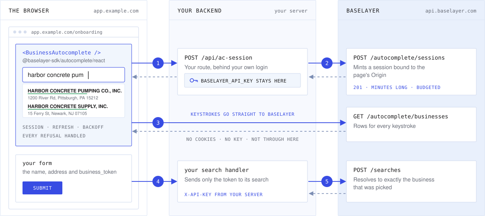
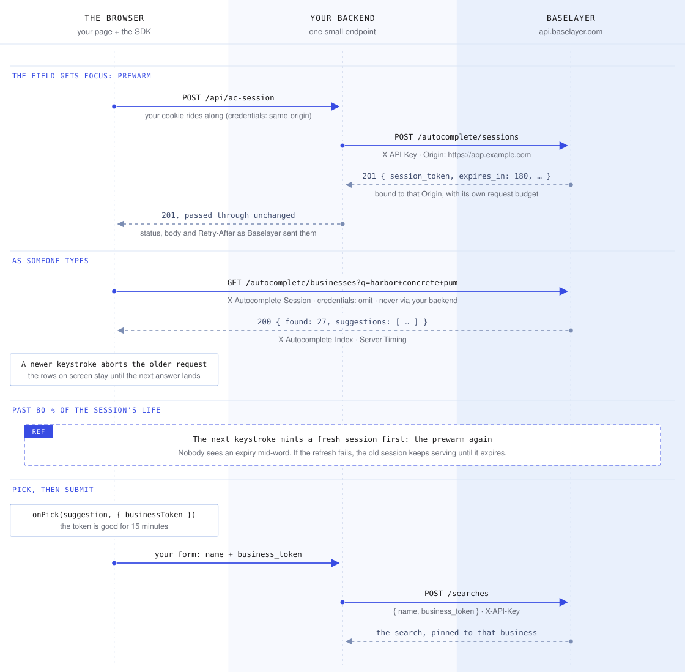

# @baselayer-sdk/autocomplete

Autocomplete for your own product, backed by Baselayer's registry, that
helps the person typing pick the right business. Every suggestion is a
canonical entity already linked to the entities around it: a business
arrives with its registered states, officers, agents and addresses, and a
`business_token` that pins your Baselayer search to exactly that business.

It searches businesses today; people, addresses and liens are coming, each
linked to the rest.

> **Pre-release.** 0.x is being adopted by the Baselayer console and
> changes on minor versions. 1.0 freezes the API.



- **Framework-free core** (`@baselayer-sdk/autocomplete`): sessions, refresh,
  backoff, and every refusal the API can answer, handled for you.
- **React** (`@baselayer-sdk/autocomplete/react`): headless hooks, and a styled
  component that looks like the Baselayer console out of the box and can be
  restyled end to end.
- **Server helper** (`@baselayer-sdk/autocomplete/server`): the one endpoint
  your backend adds, so your API key never reaches a browser.

## Install

```sh
npm install @baselayer-sdk/autocomplete
```

React 18 or 19 is an optional peer; the core and the server helper need
neither React nor a DOM.

## How it fits together



1. When the field gets focus, the SDK asks your endpoint for a session. Your
   own cookie authenticates the call.
2. Your backend mints it with your API key, forwarding the page's `Origin`,
   and returns Baselayer's answer unchanged.
3. Every keystroke goes straight to Baselayer with the session in a header:
   no cookies, no key.
4. Picking a row hands your form its `business_token`.
5. Your backend sends the token with `POST /searches`, so the search
   resolves to exactly the business that was picked.

Your API key stays on your backend. The browser holds only a short-lived
session that is bound to your page's origin and carries its own request
budget.

Request by request, from focus to submit:



Both diagrams are the site's own, rendered to files by `pnpm diagrams`; a
test fails when a file falls behind its component.

## 1. Add the mint endpoint to your backend

Next.js (App Router), in `app/api/ac-session/route.ts`:

```ts
import { createMintHandler } from "@baselayer-sdk/autocomplete/server";

export const POST = createMintHandler({
  apiKey: process.env.BASELAYER_API_KEY!,
  allowedOrigins: ["https://app.example.com"],
});
```

Express:

```ts
import { mintForOrigin } from "@baselayer-sdk/autocomplete/server";

app.post("/api/ac-session", requireLogin, async (req, res) => {
  const origin = req.get("Origin");
  if (!origin || !ALLOWED.has(origin)) {
    return res.status(403).end();
  }
  const out = await mintForOrigin({
    apiKey: process.env.BASELAYER_API_KEY!,
    origin,
  });
  res.status(out.status).set(out.headers).json(out.body);
});
```

Any other backend: see [the mint endpoint contract](docs/mint-endpoint.md).
Put the route behind your own authentication, like the rest of your API:
every session your endpoint mints counts against your organization's pool.

## 2. Drop in the component

```tsx
import { useState } from "react";
import { BusinessAutocomplete } from "@baselayer-sdk/autocomplete/react";
import "@baselayer-sdk/autocomplete/react/styles.css";

export function LegalNameField() {
  const [name, setName] = useState("");
  const [businessToken, setBusinessToken] = useState<string>();
  return (
    <BusinessAutocomplete
      id="legal-name"
      label="Legal entity name"
      baseUrl="https://api.baselayer.com"
      mintUrl="/api/ac-session"
      value={name}
      onChange={value => {
        setName(value);
        setBusinessToken(undefined); // an edit is no longer the pick
      }}
      onPick={(_, pick) => setBusinessToken(pick.businessToken)}
    />
  );
}
```

`id` seeds the combobox's ids: the input is `${id}-input`, the label
`${id}-label` and the menu `${id}-menu`. The field is controlled: `value` is
yours and `onChange` reports typing. A pick calls `onChange` with the row's
canonical name, then `onPick(suggestion, pick)`, so clearing the token in
`onChange`, as above, keeps the pick. A blur never picks.

Exactly one of these connects it:

- `mintUrl` and `baseUrl`: your endpoint, POSTed with your own cookie
  (`defaultMint(mintUrl)`, `credentials: "same-origin"`).
- `mint` and `baseUrl`: your own `MintFunction`, for any other call.
- `client`, without `baseUrl`: a client from `createAutocompleteClient`,
  shared across fields; the component never resets a client it was given.

The first `mint` or `mintUrl` is kept for the component's life; a new
`baseUrl` re-creates its client. The rest is optional:

- `mintOn` (`"focus"`): when the session is minted, one of `MINT_TIMINGS`
  (type `MintTiming`). `focus` mints as the field takes focus, so the first
  answer pays only for its suggestions, and a focus that types nothing still
  spends a mint; `keystroke` mints on the first keystroke, overlapping the
  typing; `request` mints with the first request, and that answer waits.
- `enabled` (`true`): off, the field is a plain input; nothing is minted
  and nothing is asked.
- `limit` (`5`): rows per keystroke, an integer from 1 to 20; anything else
  is refused before it is sent, and no menu opens.
- `minChars` (`3`): trimmed characters before a keystroke is sent.
- `debounceMs` (`250`): the pause after a keystroke before it is sent; a
  newer keystroke cancels it.
- `filters`: narrowing filters sent with every query. The component's own
  client holds them back while the text is shorter than the session's
  `filterMinStem`; a `client` you pass follows its own `onShortStem`
  ([Filters](docs/headless.md#filters)).
- `onUnavailable({ unavailable })`: called when the deployment stops being
  able to mint (503 code 481), and again when it can; render your plain
  input meanwhile.
- `label`: the text of the default `<label>`; without it none is drawn.
- `name`, `inputRef`, `onFocus` and `onBlur`: the input's, passed through.
- `look`, `parts`, `menuFollowsInputWidth`, `open`, `classNames`,
  `renderLabel`, `renderInput`, `renderRow` and `unstyled`: see
  [Styling](docs/styling.md); `messages`: see
  [Error states](docs/error-states.md).

## 3. Send the pick with your search

Your backend sends the token as its `POST /searches` body:

```json
{ "business_token": "…" }
```

The token stands in for `name` and `address`: send it on its own, since the
search refuses a body that carries it beside either one.

The search then resolves to exactly the business that was picked. A token
lives 15 minutes (`BUSINESS_TOKEN_TTL_SECONDS`, 900) from when the row was
served. The `pick` that `onPick` hands you carries it as `businessToken`,
with `pickedAt` and `expiresAt` (epoch ms, `pickedAt` plus those 15
minutes). `expiresAt` is advisory, and a little late, since the clock started
before the pick; the API is what refuses a stale token (422 code 3042). If
the search refuses it (expired, or the business is gone), drop the token and
search by the `name` and `address` as typed: `refusedThePin(status, code)`
tells you when that is the right move.

## Documentation

- [Mint endpoint contract](docs/mint-endpoint.md): the three rules, and
  examples for Next.js, Express and curl
- [Headless use](docs/headless.md): the hooks, and the core without React
- [Entities beyond businesses](docs/entities.md): people, addresses and
  liens, the routes to come, and `search`
- [Styling](docs/styling.md): CSS variables, class names, render props,
  `unstyled`
- [Error states](docs/error-states.md): what the SDK does with every answer
- [Security](docs/security.md): what the session is and what never leaves
  your backend
- [The site](docs/site.md): the overview, the generated API reference and
  the demo, and how to publish them
- [Live demo](docs/demo.md): try it with your own key or a session token

## Development

```sh
pnpm install
pnpm test          # vitest: core, server and site in node, react in jsdom
pnpm typecheck
pnpm lint
pnpm build         # dist/ with ESM, CJS and type declarations
pnpm site          # the site on http://localhost:3000
pnpm demo          # the same, opened on the demo, forwarding to production
```

Releases are tags; see [CONTRIBUTING.md](CONTRIBUTING.md).

## License

Apache-2.0
