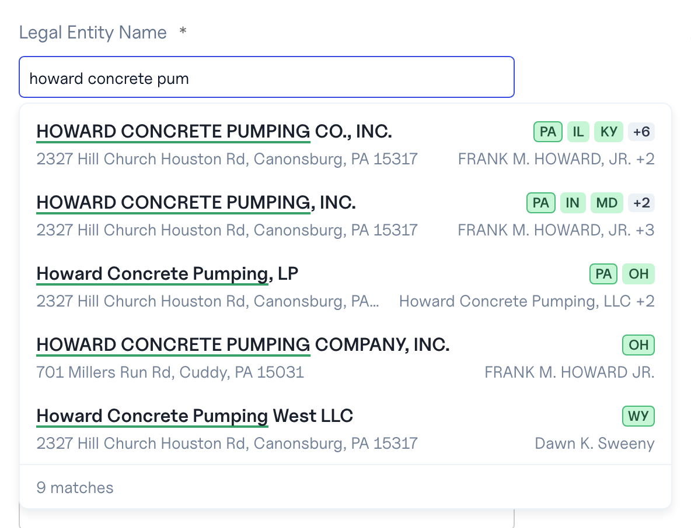

# @baselayer/autocomplete

Autocomplete for your own product, backed by Baselayer's registry, that
helps the person typing pick the right business. Every suggestion is a
canonical entity already linked to the entities around it: a business
arrives with its registered states, officers, agents and addresses, and a
`business_token` that pins your Baselayer search to exactly that business.

It searches businesses today; people, addresses and liens are coming, each
linked to the rest.

> **Pre-release.** 0.x is being adopted by the Baselayer console and
> changes on minor versions. 1.0 freezes the API.



- **Framework-free core** (`@baselayer/autocomplete`): sessions, refresh,
  backoff, and every refusal the API can answer, handled for you.
- **React** (`@baselayer/autocomplete/react`): headless hooks, and a styled
  component that looks like the Baselayer console out of the box and can be
  restyled end to end.
- **Server helper** (`@baselayer/autocomplete/server`): the one endpoint
  your backend adds, so your API key never reaches a browser.

## Install

```sh
npm install @baselayer/autocomplete
```

React 18 or 19 is an optional peer; the core and the server helper need
neither React nor a DOM.

## How it fits together


1. When the field gets focus, the SDK asks your endpoint for a session. Your
   own cookie authenticates the call.
2. Your backend mints it with your API key, forwarding the page's `Origin`,
   and returns Baselayer's answer unchanged.
3. Every keystroke goes straight to Baselayer with the session in a header:
   no cookies, no key.
4. Picking a row hands your form its `business_token`.
5. Your backend sends the token with `POST /searches`, so the search
   resolves to exactly the business that was picked.

Your API key stays on your backend. The browser holds only a short-lived
session that is bound to your page's origin and carries its own request
budget.

Request by request, from focus to submit:


Both diagrams are the site's own, rendered to files by `pnpm diagrams`; a
test fails when a file falls behind its component.

## 1. Add the mint endpoint to your backend

Next.js (App Router), in `app/api/ac-session/route.ts`:

```ts
import { createMintHandler } from "@baselayer/autocomplete/server";

export const POST = createMintHandler({
  apiKey: process.env.BASELAYER_API_KEY!,
  allowedOrigins: ["https://app.example.com"],
});
```

Express:

```ts
import { mintForOrigin } from "@baselayer/autocomplete/server";

app.post("/api/ac-session", requireLogin, async (req, res) => {
  const out = await mintForOrigin({
    apiKey: process.env.BASELAYER_API_KEY!,
    origin: req.get("Origin") ?? "",
  });
  res.status(out.status).set(out.headers).json(out.body);
});
```

Any other backend: see [the mint endpoint contract](docs/mint-endpoint.md).
Put the route behind your own authentication, like the rest of your API:
every session your endpoint mints counts against your organization's pool.

## 2. Drop in the component

```tsx
import { BusinessAutocomplete } from "@baselayer/autocomplete/react";
import "@baselayer/autocomplete/react/styles.css";

export function LegalNameField() {
  const [name, setName] = useState("");
  const [businessToken, setBusinessToken] = useState<string>();
  return (
    <BusinessAutocomplete
      id="legal-name"
      label="Legal entity name"
      baseUrl="https://api.baselayer.com"
      mintUrl="/api/ac-session"
      value={name}
      onChange={value => {
        setName(value);
        setBusinessToken(undefined); // an edit is no longer the pick
      }}
      onPick={(_, pick) => setBusinessToken(pick.businessToken)}
    />
  );
}
```

## 3. Send the pick with your search

Your backend adds the token to its `POST /searches` call:

```json
{ "name": "HOWARD CONCRETE PUMPING CO., INC.", "business_token": "…" }
```

The search then resolves to exactly the business that was picked. A token
lives 15 minutes. If the search refuses it (expired, or the business is
gone), drop the token and submit the name as typed: `refusedThePin(status,
code)` tells you when that is the right move.

## Documentation

- [Mint endpoint contract](docs/mint-endpoint.md): the three rules, and
  examples for Next.js, Express and curl
- [Headless use](docs/headless.md): the hooks, and the core without React
- [Entities beyond businesses](docs/entities.md): people, addresses and
  liens, the routes to come, and `search`
- [Styling](docs/styling.md): CSS variables, class names, render props,
  `unstyled`
- [Error states](docs/error-states.md): what the SDK does with every answer
- [Security](docs/security.md): what the session is and what never leaves
  your backend
- [The site](docs/site.md): the overview, the generated API reference and
  the demo, and how to publish them
- [Live demo](docs/demo.md): try it with your own key or a session token
- [Design record](docs/design.md): why it is built the way it is

## Development

```sh
pnpm install
pnpm test          # vitest: core and server in node, react in jsdom
pnpm typecheck
pnpm lint
pnpm build         # dist/ with ESM, CJS and type declarations
pnpm site          # the site on http://localhost:3000
pnpm demo          # the same, opened on the demo, forwarding to production
```

Releases are tags; see [CONTRIBUTING.md](CONTRIBUTING.md).

## License

Apache-2.0
