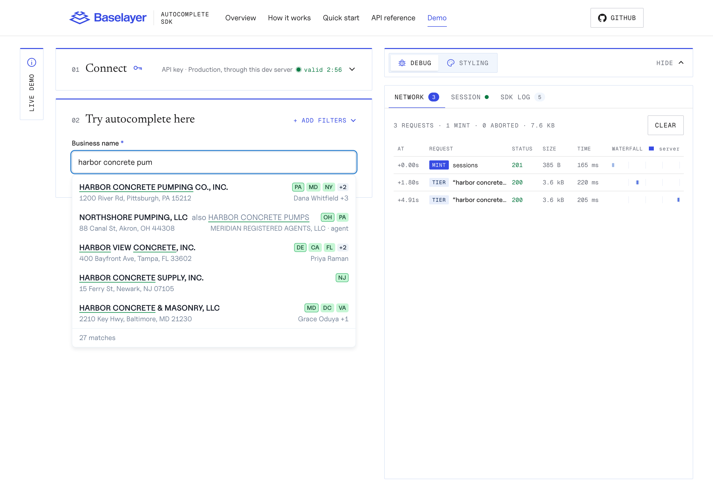
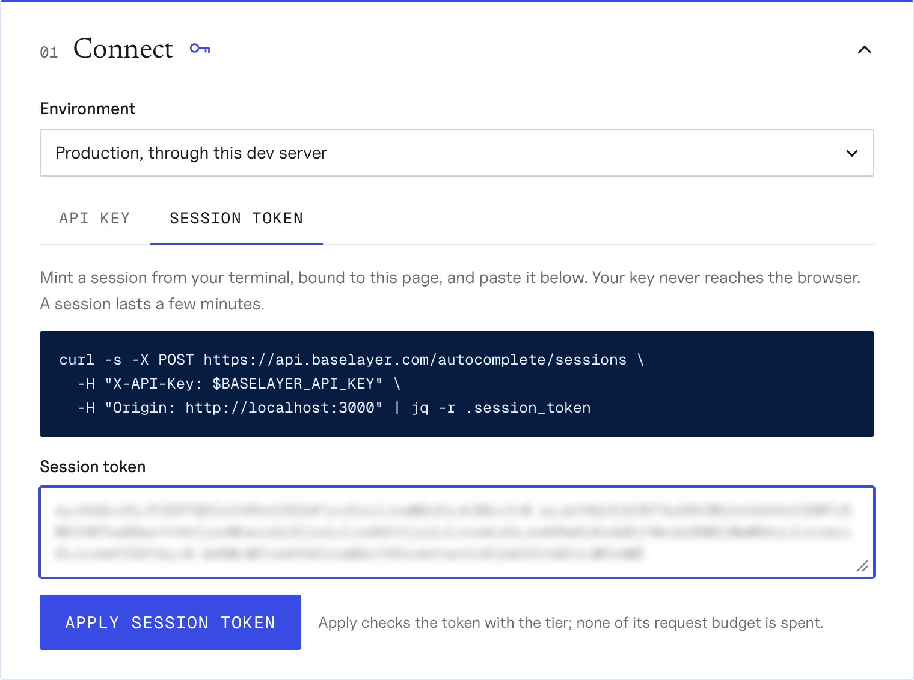
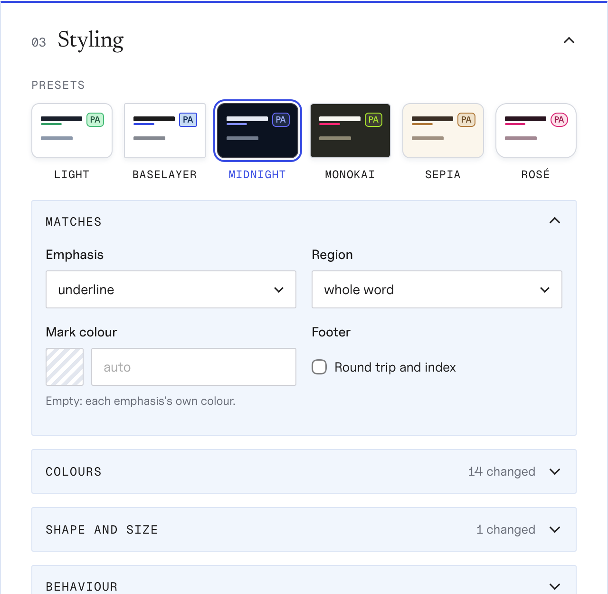
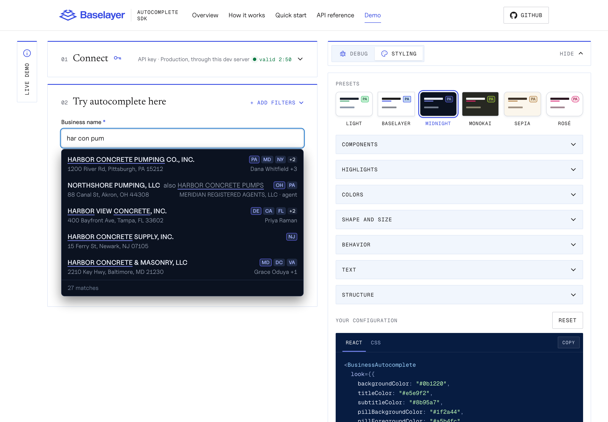
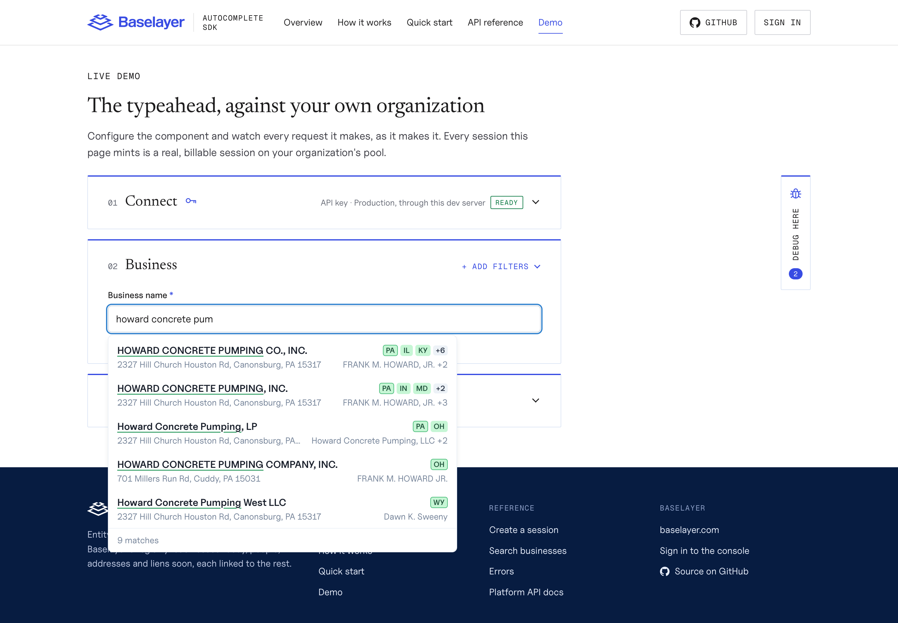
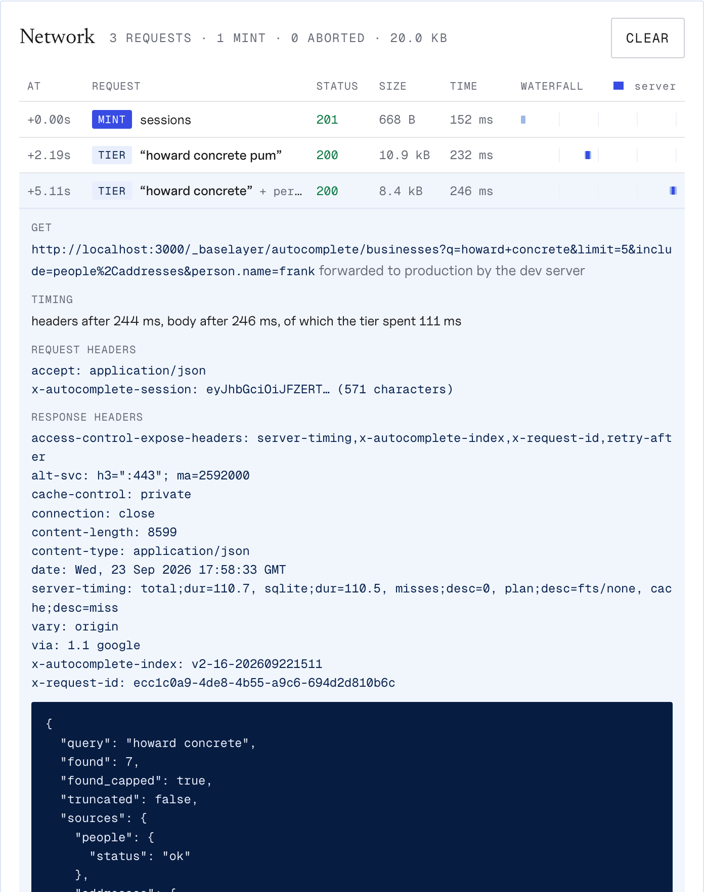

# Live demo

The demo is the styled component against your own organization. You
connect, type a business name with any filters, and restyle the component.
Beside it, folded away until you want it, is what the SDK did about it: the
session, every request on a network timeline with its timing and size, and
the SDK's own log.



It is the `/demo/` page of [the site](site.md), which the `Site` workflow
publishes from this repository's `main` to GitHub Pages, at
<https://curly-adventure-y83og2w.pages.github.io/demo/>. While the
repository is private, so is the site: open it signed in to GitHub as a
member of the osiris-ratings organization.

The published page talks to the production API, `https://api.baselayer.com`,
from the browser. That needs the autocomplete tier to answer CORS for the
demo's origin and the API to accept its mint, which osiris-app ENG-7947
deploys; until it is in production the browser refuses both calls. Run
locally, the demo needs neither (see
[Running it locally](#running-it-locally)), and the screenshots below are
production answers to a local run.

## The layout

The page is the window's height and never scrolls itself. It has three
panes, side by side, each scrolling on its own: the introduction, the
controls (01 Connect and 02 Live UI Component Test Form), and Debug or
Styling. The introduction folds to a **Live demo** tab with its **Hide**;
opening Debug or Styling folds it too, to give that pane room, and the tab
brings it back. On a narrow screen the panes stack and the page scrolls as
any other does.

## Connecting

Pick the environment, then one of two ways in, and press **Apply**. The
button stays gray until there is something to apply. Apply tests what you
gave it before the demo uses it, and says what the API answered: a refused
key, a token bound to another page, an expired one. Once it passes, Connect
folds away to one line that says how you are connected and, at its right, a
pulsing green dot with how long the session has left. A pasted token's
connection ends when the token expires; a key's does not, since the next
search mints a new session. Open Connect again to change anything. Run
locally, the page starts on **Production, through this dev server**.

**A session token (recommended).** Mint a session from your terminal, bound
to the demo's origin, and paste the token. Your API key never reaches the
browser:

```bash
curl -s -X POST https://api.baselayer.com/autocomplete/sessions \
  -H "X-API-Key: $BASELAYER_API_KEY" \
  -H "Origin: <the demo's origin, shown on the page>" \
  | jq -r .session_token
```

A session lasts a few minutes and carries its own request budget; paste a
new one when it runs out. Its terms show in the debug panel once it is
applied. Apply checks the token against the tier's
`GET /autocomplete/version`, which verifies it (signature, expiry, the origin
it is bound to) on a budget of its own, so the check spends none of the
token's requests:



**An API key.** The page mints for itself, the way your backend would. The
key stays in the tab's memory, is sent only to the API host you picked (or
to the local dev server, which forwards it there), and is never stored; the
page loads no third-party code and ships a Content-Security-Policy that
allows none. An API key has no test but a mint, so Apply mints one session
and the demo uses it: the test costs nothing the first keystroke would not
have. On the published page this mode needs the API to accept the demo's
origin.

Either way, every session is a real session on your organization's pool,
and the key must belong to a production application: sessions are not
minted for a sandbox application.

## Running it locally

```bash
pnpm install
pnpm demo        # the site, opened on http://localhost:3000/demo/
```

The page runs on `http://localhost:3000/demo/` and starts on **Production,
through this dev server**: it calls `/_baselayer/autocomplete/…` on its own
origin, and the dev server forwards those calls to production. That is the
shape of a real integration, the dev server standing in for your backend,
and it is why both modes work locally while production's CORS lists admit
neither localhost nor the published page. The browser makes no cross-origin
call at all.

The session stays bound to the page. The mint's POST carries the page's
`Origin`; the tier's GET, which a browser sends to its own origin without
one, is given the origin it came to. Point the forwarding at another API
with `DEMO_API=https://… pnpm demo`.

**Production (api.baselayer.com)** makes the calls from the browser, as the
published page does, and works once ENG-7947 is in production: a session
token from any origin, the API-key mode only from the published page's.
For another environment, pick **Custom URL** and give its API host.

## The test form

02 Live UI Component Test Form is the component on a form of its own. The
business name is always there; its suggestions open beneath it. The
filters it can carry (an officer or agent's name, the states the business
is registered in, an address) fold away behind **Add filters**, beside the
title, which counts the ones set. The SDK holds them back until the name is
long enough to narrow by, and the log says when it did. Pick a row and the
form shows the `business_token` and the search it belongs in.

## Styling

Styling and the debug panel share the right of the page: one or the other,
or neither. Folded, each is a tab beside the controls, **Debug here** and
**Style here**, reading up their spines; open one and a switch at the top of
the panel flips between the two, and **Hide** folds it back. Opened, the page
below the header widens to make room; on a narrow screen the tabs lie side by
side under the controls, and the panel opens below them.

Opening Styling folds Connect away, so the component is what you look at.
Its menu stays open, blur or no blur, and takes its place in the page rather
than lying over it. With nothing typed it shows four made-up rows that
carry every part of a row (highlighted words, a matched alternative name,
the domicile square and the overflow, an address, officers with a +N, a
registered agent, the count), so every knob can be judged before a
keystroke; type a name and the real rows take their place. The rows pretend
"harbor concr" was typed, one word in full and the next only begun, so the
region shows its difference: whole word highlights CONCRETE, typed
characters only its CONCR.

First come six presets, each a color theme drawn as a small row in its own
colors: Light (the console's), Baselayer, Midnight, Monokai, Sepia and Rosé.
A preset sets the colors, the corners and the shadow, and leaves your sizes,
behavior and text alone. Then every knob the styled component has, grouped:
how matched words are highlighted (with one color override for every
emphasis), every color (the
`look` prop's and the stylesheet's own variables, each with a swatch that
opens a color picker), shape and size, behavior (rows, related entities,
the pause before asking, prewarming), every message it can show, and the
structural switches (`classNames`, `unstyled`). Changes apply as you make
them. **Your configuration** at the bottom is the code that reproduces the
result: the props that differ from the defaults, and the CSS variables to
set.





## Debug

Its tab carries the number of requests so far. When a request is refused or
fails, or the SDK logs an error, while the panel is not showing, a red dot
pulses on the tab's bug (and on the switch's, while Styling is up) until you
open it. Folded, the page is as wide as the site's other pages.

The panel holds three cards, each of which folds: the network timeline,
open; the session, folded to its dot and timer; and the SDK's log, folded to
how many entries it has.



The network timeline lists every request the page made: when it started,
whether it was a mint or a query (with the query and any filters), its
status, the size of the body, and how long it took. The waterfall puts them
on one time axis, with the tier's own time (`Server-Timing`) drawn inside
each round trip, and a request a newer keystroke aborted drawn hatched.
Click a row for its URL, timings, headers and body; credentials are cut
short before anything is shown.



Below it, the session: its phase, the requests spent of its budget, when it
expires, and the index that answered. Under those, what the session's token
says beyond them: the origin it is bound to, how many characters of the name
the officer, state and address filters wait for, and how often the name can
be replaced by another before the tier wants a new session. Last, the SDK's
log of every mint, request, recovery and change of phase.
