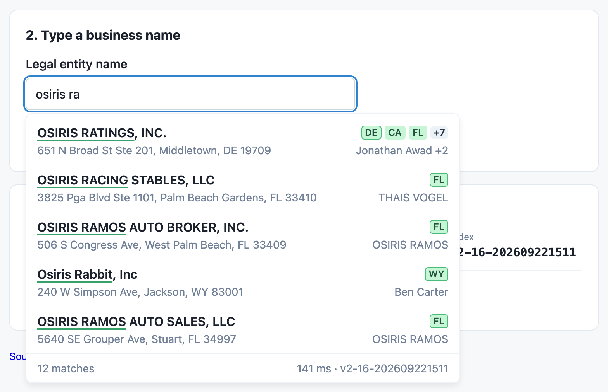
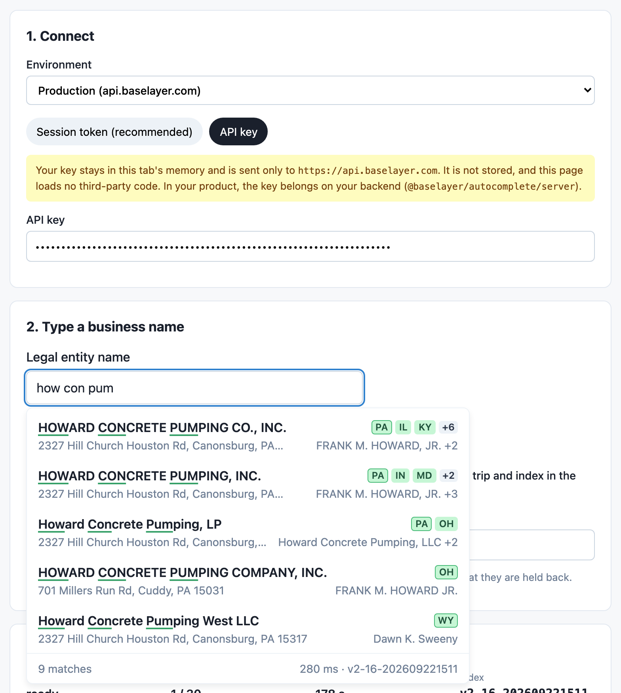
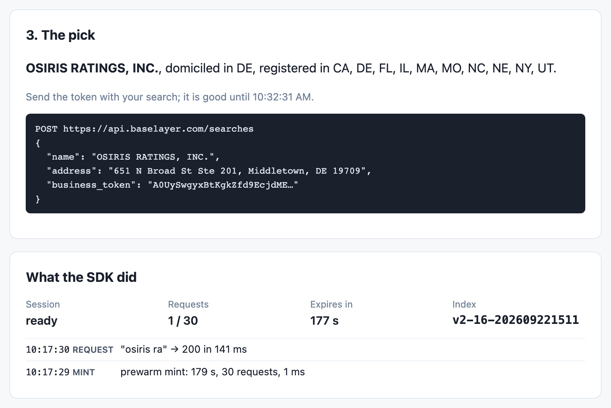

# Live demo

The demo is the styled component against your own organization, with a
log of what the SDK does on every keystroke: each mint, each request, the
recovery it chose, the session's budget and expiry, and the index that
answered.



It is published from this repository's `main` to GitHub Pages by the
`Demo` workflow, at <https://curly-adventure-y83og2w.pages.github.io/>.
While the repository is private, so is the site: open it signed in to
GitHub as a member of the osiris-ratings organization. The address changes
when the site goes public.

The page talks to the production API, `https://api.baselayer.com`, from
the browser. That needs the autocomplete tier to answer CORS for the demo's
origin and the API to accept its mint, which osiris-app ENG-7947 deploys;
until it is in production the browser refuses both calls. The screenshots
below are production answers, taken while the calls were relayed by the
test browser's harness rather than made by the page.

## Connecting

Pick the environment, then one of two ways in.

**A session token (recommended).** Mint a session from your terminal, bound
to the demo's origin, and paste the token. Your API key never reaches the
browser:

```bash
curl -s -X POST https://api.baselayer.com/autocomplete/sessions \
  -H "X-API-Key: $BASELAYER_API_KEY" \
  -H "Origin: <the demo's origin, shown on the page>" \
  | jq -r .session_token
```

A session lasts a few minutes and carries its own request budget; paste a
new one when it runs out. The page reads the token's terms and shows them:


**An API key.** The page mints for itself, the way your backend would. The
key stays in the tab's memory, is sent only to the API host you picked, and
is never stored; the page loads no third-party code and ships a
Content-Security-Policy that allows none. This mode needs the API to accept
requests from the demo's origin.



Either way, every session is a real session on your organization's pool,
and the key must belong to a production application: sessions are not
minted for a sandbox application.

## Running it locally

```bash
pnpm install
pnpm demo        # http://localhost:3000
```

Locally the page runs on `http://localhost:3000`. Production accepts a
session token from there once the tier answers CORS for every origin
(ENG-7947); the API-key mode needs the API to list the page's origin, which
production does for the hosted demo only. For another environment, pick
**Custom URL** and give its API host.

## What it shows

Pick a row and the page shows the `business_token` and the search it
belongs in, beside the SDK's own account of the session: its phase, the
requests spent of its budget, when it expires, the index that answered,
and a log of every mint and request with its status, latency and recovery.


