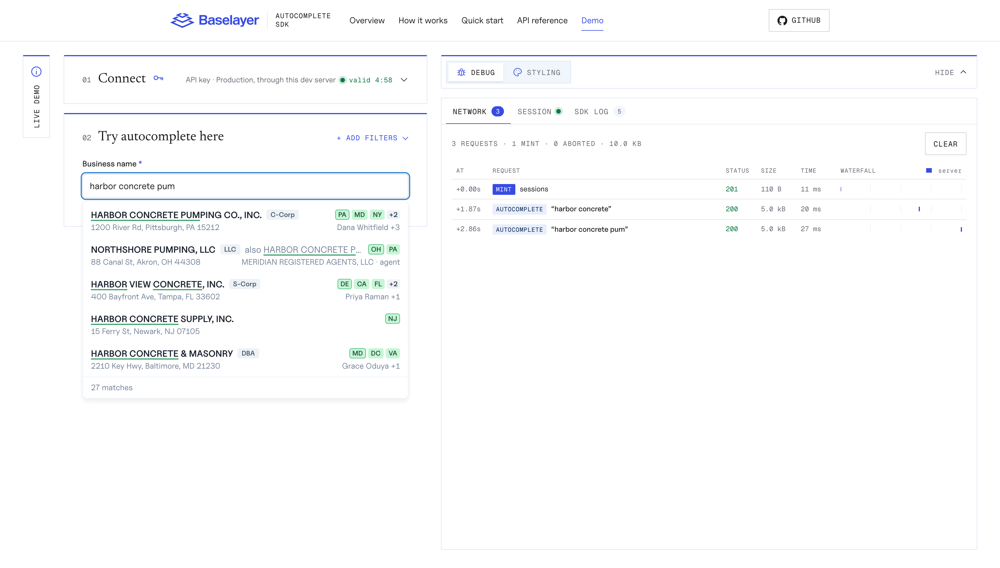
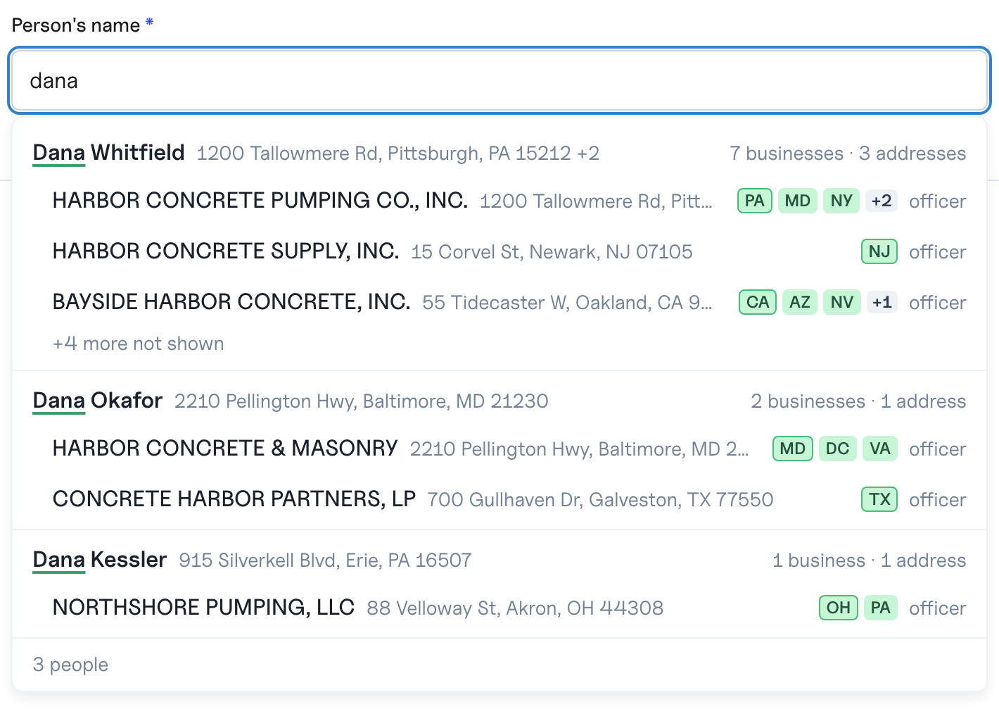
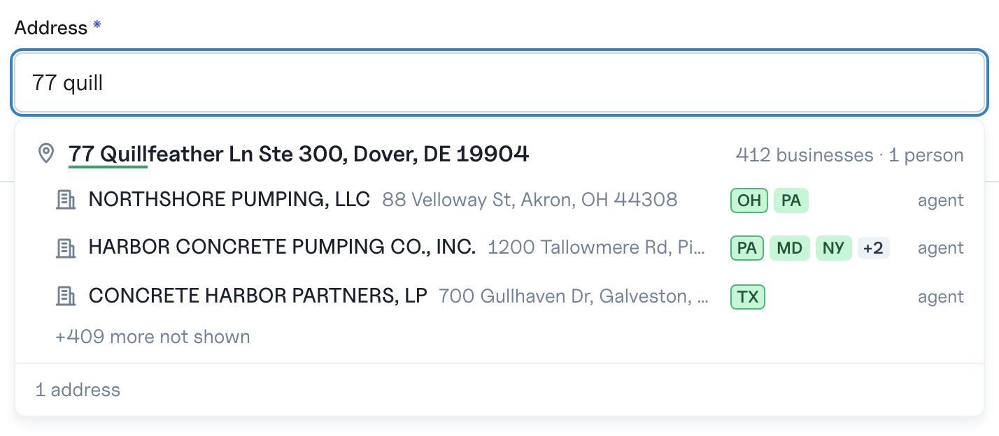
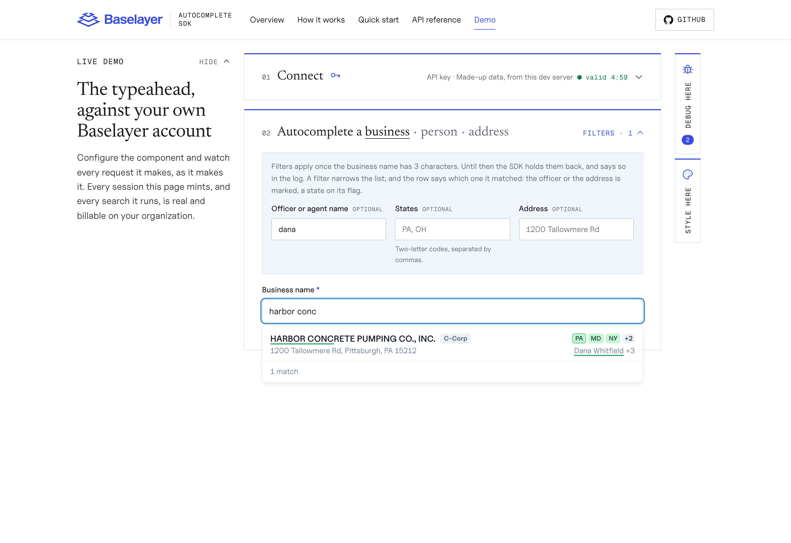
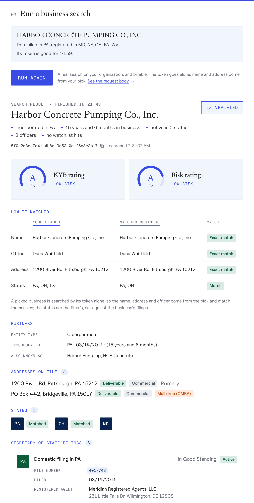
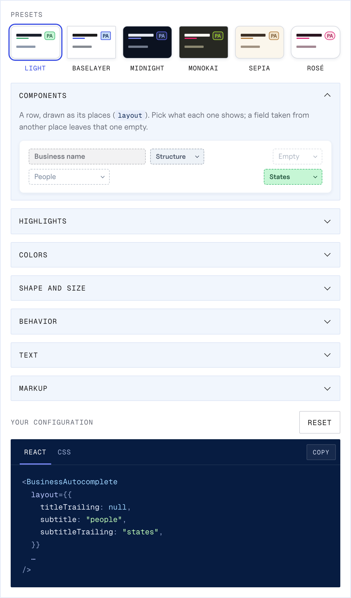
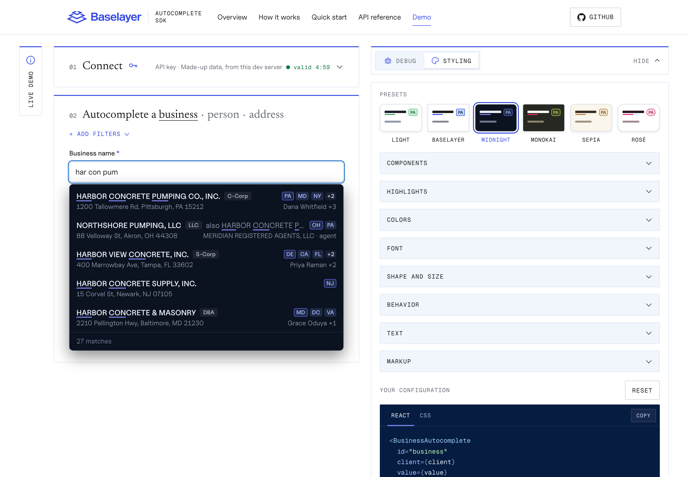
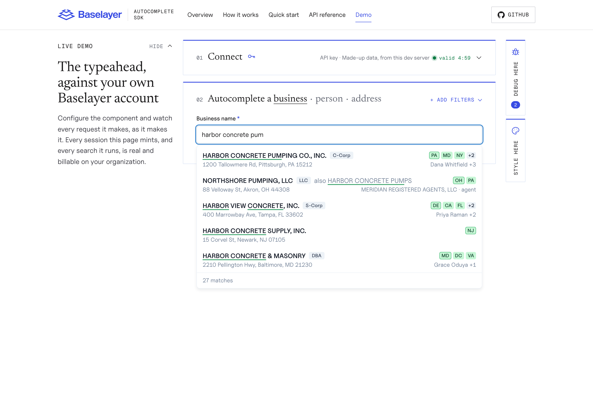
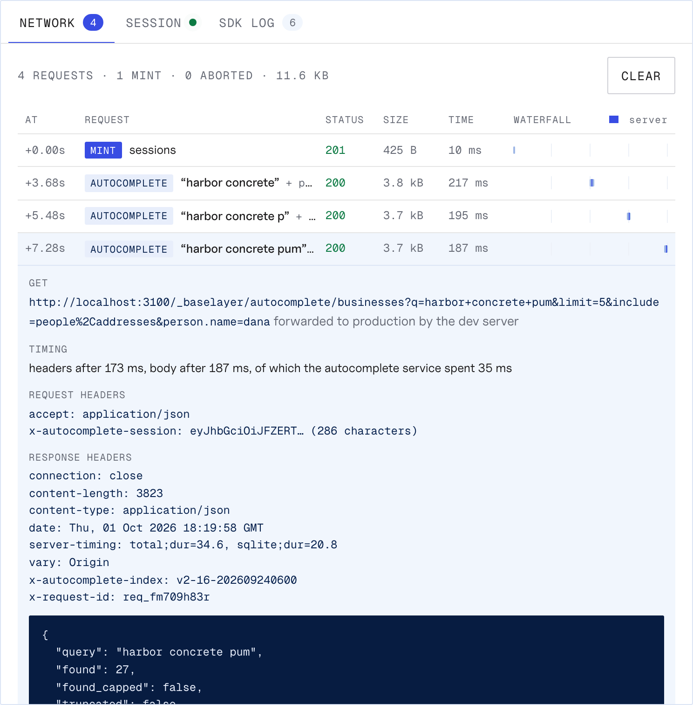

# Live demo

The demo is the styled components against your own Baselayer account. You
connect, find a business by its name, through a person or through an address,
run the search a pick leads to, and restyle the component. Beside it, folded
away until you want it, is what the SDK did about it: the session, every request
on a network timeline with its timing and size, and the SDK's own log.



It is the `/demo/` page of [the site](site.md), which the `Site` workflow
publishes from this repository's `main` to GitHub Pages, at
<https://sdk.baselayer.com/autocomplete/demo/>.

The published page talks to the production API, `https://api.baselayer.com`,
from the browser. That needs the autocomplete service to answer CORS for the
demo's origin and the API to accept its mint and its search; where either
does not, the browser refuses the call. Run locally, the demo needs neither (see
[Running it locally](#running-it-locally)). The screenshots below are the
demo answering from made-up businesses, so no real company or person
appears in them.

## The layout

The page is the window's height and never scrolls itself. It has three panes,
side by side, each scrolling on its own: the introduction, the controls (**01
Connect** and **02 Autocomplete a business**, and **03 Run a business search**
once a business is picked), and Debug or Styling. The introduction folds to a
**Live demo** tab with its **Hide**; opening Debug or Styling folds it too, to
give that pane room, and the tab brings it back. On a narrow screen the panes
stack and the page scrolls as any other does.

The panes move as they change, so it is plain where each went. Opening one,
its tab turns a quarter about the square at its top, where its icon is, as it
moves to the top of the pane, never rising above the pane's top nor reaching
past its start; the pane's head extends out of it, and the rest unrolls
downward from under the head. Folding one away goes the other way, one step at
a time: the pane rolls up into its head and turns back into its tab where it
stands, and only then do the controls move over and widen. With reduced
motion, or in a browser without view transitions, the panes change at once.

## Connecting

Pick the environment, give an API key and press **Apply**. The button stays
gray until there is something to apply. Apply tests the key before the demo
uses it, and says what was wrong: a key the API does not recognize, one
without the permission, or a sandbox application's. Once it passes, Connect
folds away to one line that says how you are connected and, at its right, a
dot with how the session stands: pulsing green with the time it has left
(`valid 2:56`), blue while it is `idle` or `minting`, and red while the SDK
backs off (`retry in m:ss`) or once it is `unavailable`. It reads `idle` until
the component takes its first session (on the first keystroke, by default).
When a session lapses the connection stays, since the next search mints a new
one, and until then the line reads `renews on the next search`. Open Connect
again to change anything. Run locally, the page starts on the dev server,
named by what it stands in front of: **Production, through this dev server**,
the host `DEMO_API` names, or **Made-up data, from this dev server**.

The page mints for itself, the way your backend would. The key stays in the
tab's memory, is sent only to the API host you picked (or to the local dev
server, which forwards it there), and is never stored; the page loads no
third-party code, and the published page ships a Content-Security-Policy that
allows none (`pnpm demo` adds none: its hot reload needs an inline script). An
API key has no test but a mint, so Apply mints one session and the demo hands
it to the component as its first: the test costs nothing the component's own
first mint (on the first keystroke, by default) would not have. On the
published page this needs the API to accept the demo's origin.

Every session is a real session on your organization's pool. The session's
scope, which the mint answers, decides which searches the form offers.

## Running it locally

```bash
pnpm install
pnpm demo        # the site, opened on http://localhost:3000/demo/
```

The page runs on `http://localhost:3000/demo/` and starts on **Production,
through this dev server**: it calls `/_baselayer/autocomplete/…` and
`/_baselayer/searches` on its own origin, and the dev server forwards those
calls to production. That is the shape of a real integration, the dev server
standing in for your backend, and it is why the demo works locally while
production's CORS lists do not admit localhost. The browser makes no
cross-origin call at all.

The session stays bound to the page. The mint's POST carries the page's
`Origin`; the autocomplete service's GET, which a browser sends to its own
origin without one, is given the origin it came to. Point the forwarding at
another API with `DEMO_API=https://… pnpm demo`.

`DEMO_API=sample pnpm demo` needs no network and no key: the dev server
answers every call itself, from the made-up businesses, people and addresses
in `site/demo/sample.ts`. Any key applies, and its sessions may search every
route; `DEMO_SCOPE=businesses,people` (a comma list of routes) narrows them,
and a route outside it is refused as the autocomplete service refuses it. A
pick runs a made-up search of that business, with the person or address it
was found through on it, as the API records them. Nothing of it reaches a
build.

**Production (api.baselayer.com)** makes the calls from the browser, as the
published page does, which the API admits only from the published page's
origin. For another environment, pick **Custom URL** and give its API host.

## The test form

**02 Autocomplete a business, a person, or an address** is the component on a
form of its own. Its title says what the field searches for, each search with
its article: the selected one in blue, its noun underlined, the others muted and
a click or an arrow key away. It offers only the searches the session's scope
allows (**Autocomplete a business or a person** with two), and with businesses
alone it reads **Autocomplete a business**; before you connect it offers all
three, so Styling can show each. Business is the business name and
its suggestions. Person and Address find the business another way: each
person or address that fits comes with its counts (`7 businesses · 3
addresses`), a person's first address, and a line for each of its first
businesses, with the business's address, its states and the role there. Each
business is a pick. A pick stays where it was made: the field takes the
person's name or the address, and a line under it names the business picked,
until you edit the field. Each search keeps its own text and its own pick:
switching to another and back puts them back as they were, and the search
switched to shows what was last typed in it, not what the other field held.





The filters each search can carry, where the session's scope allows them (on
Business an officer or agent's name, the states the business is registered
in and an address; on Person the states their businesses are in; on Address
the address's own state), fold away behind **Add filters**, beside the title, which
counts the ones set; they sit side by side, and stack on a narrow pane. The SDK
holds them back until the business name (not the officer's) has as many
characters as the session's `filter_min_stem` asks for, which the hint above the
filters names, and the log says when it did. The menu stays open while you type
in a filter, and the list narrows as you do, after a pick too: editing a filter
searches the picked name again. A filter narrows the list, and the row says
which one it matched: the officer or the address is marked, a state on its
flag. Pick a row and the next step appears under the form.



## Running a search

**03 Run a business search** is the search the pick belongs in, and the page
has no such step until you pick a row. Then the card names the business, says
where it is domiciled and registered (or the person or address it was found
through), and counts down the token's 15 minutes.
**See the request body** folds out the `POST /searches` the pick belongs in,
with the token cut short; **Run business search** sends it with the token alone
(the API takes the name and address from it, and refuses it beside either), and
the report appears below. A search is a real, billable search on your
organization, so it never runs by itself. Change the name or any filter and the
pick is gone, since it was made under them, and the step closes up and goes with
it (the page stops waiting for a search still running, which goes on at the API);
pick a row again for the next.

The call asks the API to hold it until the search ends (`Prefer: wait=90`) and
names the pick's search with an `Idempotency-Key`. The key stays the same until
a search comes back, so running again after a failure (an answer that never
arrived, a 5xx, a wait that gave up) gets the search the first call made, not a
second one to pay for. Running again after a report is a new search, with a new
key. A search the API is still running after that wait is asked after every two
seconds, for two minutes at most, and fetched whole when it ends. A question
that fails in passing (the network, a 429, a 5xx) is asked again at the next
turn; one that fails for good ends the wait, and the message says the search
keeps running and where to find it. A search that finds no business is not an
error: the API ends it as failed, with `No match found.`, and the report says
so. The SDK does not submit searches; the call and its types are the demo's
own, in `site/demo/searches.ts`.



The report is one page of sections, and a section the search has nothing for is
left out: the verdict (verified, not verified, a fraud hit or no match), the
KYB and risk ratings, how the search matched, the business, the addresses and
states it has on file, its Secretary of State filings, its officers, and the
watchlists it was screened against. **How it matched** sets what your pick
matched against what the search found, a row for the name (the name it goes by,
when you matched one), the officer, the address and the states: the address is
the one on file that matched, not the business's primary, and the states are
those you filtered by against those the business is in. A business picked
through a person has that person as its officer, and one picked through an
address that address, as the API records them from the token, and a line
under the table says whose businesses it was picked from. What you typed is
underlined in green where it matched, as the typeahead's rows underline it, but
the whole of the name, officer or address it reached rather than the letters
typed (`baselaye` underlines all of `Baselayer`, and `353 quenby street` all of
`353 Quenby St Fl 14, San Francisco, CA 94105`, though `street` is not `St`).
A name the business goes by reads `(DBA …)` in grey, beside its legal name, with
the underline kept on the name you matched, and the business's **Also known as**
leads with that name, underlined too. The lists that follow lead with what
matched: the addresses (the first ten, then a count of the rest) and the
officers, each marked **Matched** and underlined the same way. The Secretary of
State filings lead with the domicile's, then the filing in a state you filtered
by, marked **Matched** and its square underlined. The states are squares in the
same order: the domicile's green, as its filing is, and the ones you filtered by
underlined.
Each address has a bullet for what stands there, an office block, a house, an
envelope for a mail drop, or a pin where the API does not say, which the pills
beside it say in words. Under it, **View raw response** is the body as the API
sent it, **See the request in Debug** opens the call on the network timeline,
and **Open in the console** is the same search in Baselayer's console.

Only an API key can run it: the session the typeahead holds opens the
autocomplete service and nothing else. A pick's token lasts 15 minutes, and
after that the card asks for a new pick. A refusal is put in words, with what to
do about it: pick the business again for a token that expired or is another
organization's, or fix the key. After a refusal of the pick, Run stays off until
you pick again.

## Styling

Styling and the debug panel share the right of the page: one or the other,
or neither. Folded, each is a tab beside the controls, **Debug here** and
**Style here**, reading up their spines; open one and a switch at the top of
the panel flips between the two, and **Hide** folds it back. The switch stays
put as the panel scrolls, as far below the site's header as the controls
start, with what scrolls under it blurred. Opened, the page below the header
widens to make room; on a narrow screen the tabs lie side by side under the
controls, and the panel opens below them.

Opening Styling folds Connect away, so the component is what you look at. Its
menu stays open, blur or no blur, and takes its place in the page rather than
lying over it. With nothing typed it shows made-up rows, as many as Rows asks
for (five by default, eight at most), that carry every field of a row
(highlighted words, a matched alternative name, the domicile square and the
overflow, a spread of structures, one on a name with no suffix and one not
known, an address, officers with a +N, a registered agent, the count), so every
knob can be judged before a keystroke; type a name and the real rows take their
place. On Person and Address the made-up rows are people and addresses, each
with its businesses, as many as Rows asks for. The Components fold edits the
row of the search the form is on, with a tab for each (Business, Person,
Address) that moves the form with it. Its row map draws each line of that row,
the head first, in two drawers. Shown holds the lines the row lists, in the
order it lists them: a line is dragged by its grip to another spot in Shown,
the other lines making way, or into Hidden to leave it out, and back again as
it was. A shown line's Enabled checkbox, in a column with a faint guide down it,
marks it as one that can be chosen; an unticked line is drawn dimmed, as the
menu draws it. Hidden, faintly striped, holds the hidden lines and the fields
the row leaves out. A field moves only within its own line, and a segment's icon
goes on or off from its chip: on, off with a slash, or frozen on a hidden line.
Each line keeps to one row, scrolling sideways when it runs out of room. The
rows pretend "harbor concr" was typed, one word in full and the next only begun,
so the region shows its difference: whole word highlights CONCRETE, typed
characters only its CONCR.

Behavior acts on the sample rows as it would on real ones: Rows sets how many
there are, up to the sample's eight. The characters, the pause and the session
act only as you type. What a row fetches follows from its layout: place the
address nowhere and the addresses are not asked for, place the people nowhere
and the people (officers and agents) are not. Place neither and no `include`
is sent, since the autocomplete service refuses an empty one, so its default,
people and addresses, comes back all the same, only not drawn.

First come the presets, twenty looks in a carousel that scrolls sideways:
swipe or scroll to browse it, or turn a page with the buttons at its ends or
the dots between them, and a shade at an edge says there is more; the arrow
keys pick the next preset or the one before. Light comes first, the default
with matched ink in green, then Baselayer, Midnight, Monokai, Sepia and Rosé,
then fourteen more. Each is drawn as a sign of itself in its colors and
corners: a title with its match marked under it, a flag, a bar for each line
its row draws below the title on the search the form is on, and a square
before the title where the name carries an icon. A preset sets the colors,
how a match is marked, the font, the corners and the shadow, the line height
and the weights, and each search's row: where its fields sit, the lines it
lists and which can be chosen, and its icons. The menu's width, the list's
height and its stacking are the host's layout, and with behavior and text
they stay as you set them; while anything a preset sets is changed, the
presets read **Custom**. Then every knob the styled component has,
in sections that start folded: the components a row shows, drawn
as the row itself (the name, which always shows, then each line's two corners,
a field and the badge pinned to its inner side; each place drawn as the field
it holds, and as wide as where it sits, whatever it holds, so the two lines'
columns line up and a chevron stays put. Under the row, folded away, a table
says which fields of the autocomplete service's answer each field reads. A
field is dragged, by mouse or by finger, onto another place, where it swaps
with what was there, or into Hidden, with the fields the row leaves out. While
it flies, tilted and drawn as the cell it left, every spot that takes it is
lit. The fold shows only layouts the row can draw: a drop lands only where the
field would stay; a place nothing can go in yet, a badge beside an empty field
or the second line's right with no lead, is hidden, keeping its room; and a
field that leaves the lead lets the right corner slide into it, as the row
does. Each place's chevron is also a dropdown of what it can show, and picking
a field from another place swaps it with what the place held, as a drop does),
how matched words are highlighted (the emphasis, the region, and one color
override for every emphasis) and whether the footer shows the round trip and
the index that answered (`look.showDebugInfo`, a switch in the same fold),
every color (the `look` prop's and the stylesheet's own variables, each with a
swatch that opens a color picker), the font (the page's, the system's, a serif
or a mono this page loads, or a stack of your own; the name's weight and the
weight emphasis's two; and the HTML or CSS that loads a font of your own in the
weights picked), shape and size, behavior (rows, 1 to 20; the characters typed
before it asks, 2 to 10 and 3 by default; the pause before asking; when the
session is minted: on the first keystroke, as it is by default, on focus or
with the first request; and whether the menu is as wide as the input, as it is
by default), the text (the label, and every message that is a string: `more`
and `httpFallback` are functions, so they keep their defaults; and each
structure's flag, an empty one drawing none), and the markup switches
(`classNames`, `unstyled`). Changes apply as you make them. A color changed
from its preset's carries a reset inside its field, which puts back the value
the last preset chosen gave it. **Your configuration** at the bottom is the
code that reproduces the result, in a React tab and a CSS tab with a **Copy**:
the props every host gives (the `id` filled in; the client, the value and the
handlers left to you), then those that differ from the defaults (the `layout`
names only the places that differ from the SDK's), for the search the form is
on, and the CSS variables to set. Its **Reset** puts the whole panel back as it
opened: the Light preset and every default.





## Debug

Its tab carries the number of requests so far. When a request is refused or
fails, or the SDK logs an error, while the panel is not showing, a red dot
pulses on the tab's bug (and on the switch's, while Styling is up) until you
open it. Folded, the page is as wide as the site's other pages; open, it is as
wide as the window, so the network table has the room there is for a whole
request. Where the pane is narrow, a request wraps under its kind rather than
being cut off. Styling's page keeps the site's wide measure.



The panel is one card, down to the foot of the page, with three tabs:
**Network**, first, counting the requests; **Session**, with the connection's
dot; and **SDK log**, counting its entries. What a tab holds scrolls inside
the card.

Network is the timeline of every request the page made: when it started, whether
it was a mint (`mint`), a query (named by its route, `businesses`, `people` or
`addresses`, with the query and any filters), a call of the search step
(`search`: its `POST /searches` and the questions after it) or another call
(`http`), its status, the size of the body, and how long it took. It draws the
last 60, under a line that counts the requests, the mints, the aborted ones and
the bytes, beside a **Clear**. The waterfall puts them on one time axis, with
the autocomplete service's own time (`Server-Timing`) drawn inside each round
trip, and a request a newer keystroke aborted drawn hatched. Click a row for its
URL, timings, headers and the bodies it sent and got; credentials and tokens are
cut short before anything is shown.



Session has its phase, the requests spent of its budget, when it expires, and
the index that answered. Under those, what the session's token says beyond
them: the origin it is bound to, how many characters of the name the officer,
state and address filters wait for, and how often the name can be replaced by
another before the autocomplete service wants a new session. SDK log is the
SDK's own account of every mint, request (led by its route), recovery and
change of phase, newest first and the last 80 kept, with a **Clear** of its own.
