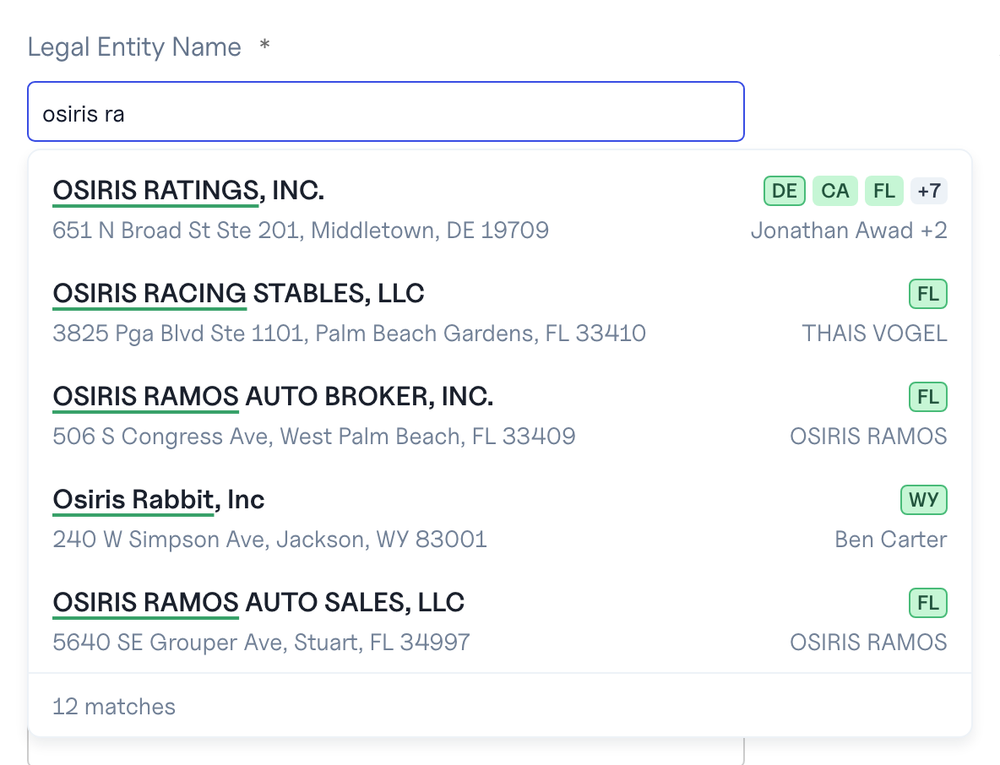
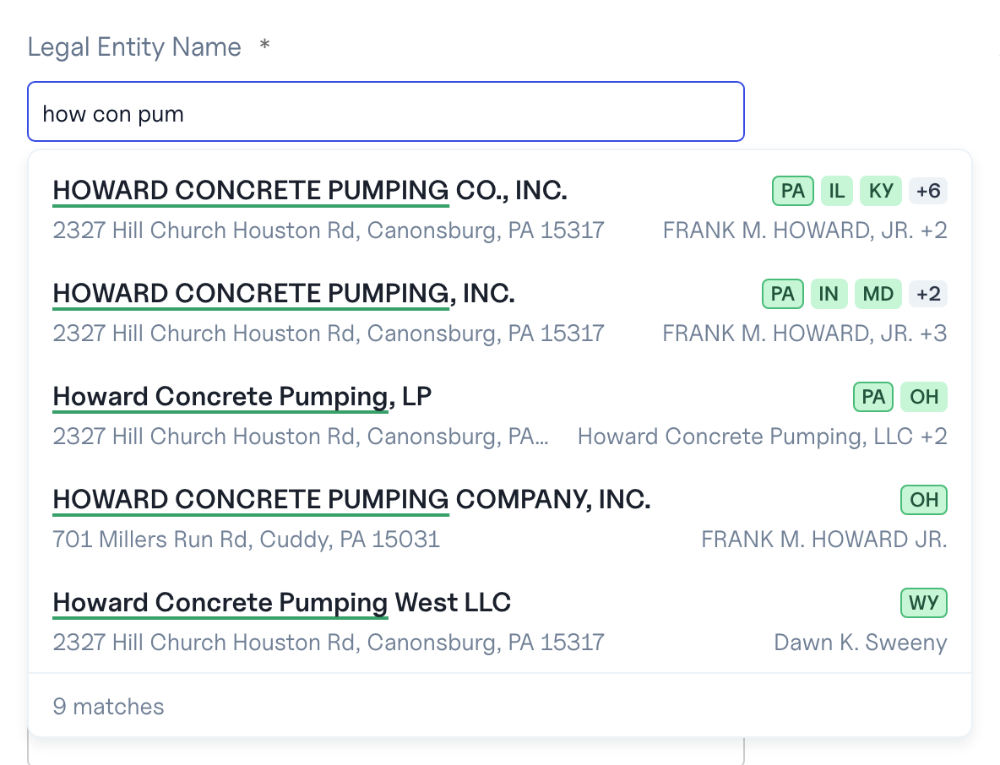

# Autocomplete Web SDK — Design

Status: Implemented in this repository (ENG-7943; design ENG-7954)
Author: Klemen Verdnik (with Claude Code)
Last updated: 2026-09-22

This is the design record. The customer documentation is the
[README](../README.md) and the other pages in this directory.

## Context

The Legal Entity Name typeahead in the console is the reference
implementation of the autocomplete product. It is about 1,500 lines of
TypeScript that mint and refresh sessions, debounce keystrokes, talk to the
tier, honour every refusal the API and the tier can answer, and turn a pick
into a `business_token` on the search. A further 3,000 lines of tests prove
each of those behaviours.

A customer embedding autocomplete in their own product would have to rebuild
all of that from the API documentation, and would get each edge wrong once:
the 80 % refresh, the difference between a spent ten-minute window and a
spent day, the step-aside when a deployment cannot mint, the re-mint on a
spent budget, the one-recovery-per-keystroke rule that keeps a typing user
from hammering a refusing API.

That knowledge belongs in a public SDK. The proof that the SDK is complete
is that our own surfaces run on it: the console's typeahead and the admin
console's playground ([ENG-7941](https://linear.app/base-layer/issue/ENG-7941))
are rebuilt on the SDK, with no visible change to the console.

This document is the design. It settles what the SDK promises, where it
lives, how a customer authenticates it, how our two consoles host it, and
in what order the migration happens. It does not settle internals beyond
what the promises require.

Companion documents: `docs/autocomplete-service.md` in osiris-app is the
tier and mint runbook; this repository carries its own customer
documentation (see "SDK documentation").

## What the SDK reproduces

The console's typeahead as it stands, captured on 2026-09-23 against the
production index `v2-16-202609221511`. Each row is the canonical name with the
matched words marked, the family's states as squares (domicile first),
the lead address and the lead officer; the footer carries the count. The
styled layer of the SDK has to draw exactly this, and the console's
migration is judged against these pixels.



A three-stem query, each stem matching a different word of the name:



## Goals

- One npm package, `@baselayer/autocomplete`, that a customer installs and
  drives with their own backend as the only piece of server code they write.
- The console and the admin console consume that package as ordinary npm
  consumers, pinned to an exact version.
- Every behaviour the console has today survives the move, with its tests.
- Every timing, threshold and message is configuration with our defaults;
  every visual element is reachable by class name, CSS variable or slot.
- A framework-free core, so a second binding is a thin layer.

## Non-goals

- New tier or API capabilities. The SDK exposes what
  `POST /autocomplete/sessions` and `GET /autocomplete/businesses` offer
  today.
- A Vue, Svelte or plain-DOM binding. The core is written so one is
  possible; none ships in 1.0.
- A hosted `<script>` tag or a CDN build.
- Any visible change to the console's typeahead.
- Person, address and lien autocomplete. They arrive with their tier routes
  and extend the same client.

## How a customer embeds it

The browser must never hold an API key, and the grant the tier accepts is
bound to the page's `Origin`. So the mint is server to server, from the
customer's backend, which already holds the key for its search calls. The
grant travels back to the page, and the page talks to the tier directly.

```text
customer's page (browser)      customer's backend        Baselayer
─────────────────────────      ──────────────────        ─────────────────
SDK: needs a grant
  POST /api/ac-session  ─────► mint on its behalf
  (their route, their auth)      POST /autocomplete/sessions ──► API
                                   X-API-Key: <their key>
                                   Origin: <page origin>  (forwarded)
                                 ◄── 201 grant, or 429 + Retry-After,
                                     403, 422, 503
  ◄──────────────────────────── pass status, body and
                                Retry-After straight back
SDK: keystrokes go direct
  GET /autocomplete/businesses?q=… ────────────────────────► tier
    X-Autocomplete-Session: <grant>                       grant.ori ==
  ◄─────────────────────────────────────────────────────── Origin? rows
```

Three rules make this safe, and the SDK's server helper (see "Server helper")
encodes all three:

1. **Forward the page's `Origin`.** The API stores whatever `Origin` it
   receives in the grant's `ori` claim. The tier then refuses that grant from
   any other origin, and refuses it when no `Origin` is sent at all. A mint
   with no `Origin` produces an unbound grant that works from anywhere; a
   backend must never do that for a browser.
2. **Pass the refusal through unchanged.** The SDK reads the status, the
   error envelope (`code`, `metadata.scope`) and the `Retry-After` header
   to decide whether to wait silently, tell the user, or step aside. A
   backend that flattens a 429 into a 500 breaks that.
3. **Never forward cookies or the key.** The tier reads one credential, the
   grant, from a header. The SDK fetches with `credentials: "omit"`.

The wire contract the backend proxies, for a non-Node backend:

```bash
curl -s -X POST https://api.baselayer.com/autocomplete/sessions \
  -H "X-API-Key: $BASELAYER_API_KEY" \
  -H "Origin: https://app.customer.com"
# 201 {"session_token": "...", "expires_in": 180,
#      "request_budget": 30, "pivot_allowance": 5,
#      "filter_min_stem": 5}
```

| Mint answer           | Meaning                       | SDK behaviour                          |
| --------------------- | ----------------------------- | -------------------------------------- |
| 201                   | grant                         | cache, refresh at 80 % of `expires_in` |
| 401 20/21/22/24       | key rejected                  | report `mint_refused`, wait 10 s       |
| 402 3004              | organization locked           | report `mint_refused`, wait 10 s       |
| 403 30                | key lacks `autocomplete.read` | report, wait 10 s                      |
| 403 37                | `autocomplete.enabled` is off | report, wait 10 s                      |
| 422 483               | sandbox application           | report, wait 10 s                      |
| 429 429, scope window | ten-minute pool spent         | wait `Retry-After`, silent             |
| 429 429, scope day    | daily pool spent              | wait, tell the user                    |
| 503 481               | deployment cannot mint        | step aside for 5 min                   |

The scopes are `autocomplete_session_mint:organization` and
`autocomplete_session_mint_day:organization`; the pools are per
organization, shared by every user and key in it, and the plan sets them
([ENG-7930](https://linear.app/base-layer/issue/ENG-7930)).

The customer's search call is unchanged: when the user picks a row, the
customer's page hands the `business_token` to its backend, which puts it in
`POST /searches` as `business_token`. The section "Picking" covers what
happens when that search refuses the pin.

## Who mints where

The SDK does not know how a grant is obtained. It takes a `mint` function
and treats every host the same from there on. Three hosts, three
implementations of that one function:

| Host          | `mint` implementation               | Mint travels            |
| ------------- | ----------------------------------- | ----------------------- |
| console       | axios `api.post`, Keycloak bearer   | browser → API           |
| admin console | the admin API client, its bearer    | browser → API           |
| customer      | `defaultMint(url)` to their backend | browser → backend → API |

The console and admin already hold a user token in the browser, so they
mint directly, exactly as the console does today. A customer holds an API
key, which cannot live in the browser, so the mint hops through their
backend. Neither console uses the server helper.

The console's adapter is about ten lines and stays in the console:

```ts
// interfaces/console/src/services/autocompleteMint.ts
import { parseMintResponse, type MintFunction } from "@baselayer/autocomplete";
import axios from "axios";
import { api } from "services/api";

export const consoleMint: MintFunction = async () => {
  try {
    const res = await api.post("/autocomplete/sessions", undefined, {
      transformResponse: raw => raw, // keep the wire's snake_case
    });
    return parseMintResponse(res.status, res.headers, JSON.parse(res.data));
  } catch (error) {
    if (axios.isAxiosError(error) && error.response) {
      const { status, headers, data } = error.response;
      return parseMintResponse(status, headers, data);
    }
    throw error;
  }
};
```

Everything downstream of `parseMintResponse` (the refresh, the backoff, the
scopes, the 481 step-aside) is one code path regardless of which host
produced the grant. The SDK stays axios-free.

## Repository, package and layers

The SDK lives in its own repository,
`osiris-ratings/baselayer-autocomplete-typescript`, following the org's
`baselayer-<product>-<language>` pattern beside the `baselayer-typescript`
and `baselayer-python` API clients. It has its own CI, its own release
process and its own documentation. This monorepo keeps the tier, the API,
the two hosts and this design.

The repository is private until 1.0, when it flips public with the launch.
The package is published to public npm from 0.1 onward, because that is how
the console and the admin console consume it. Publishing during stealth is
acceptable: the mint is entitlement-gated, so an unentitled installer gets a
403 and nothing else.

One package, four entry points:

| Entry                     | Contents                             | Runtime deps | Peers            |
| ------------------------- | ------------------------------------ | ------------ | ---------------- |
| `@baselayer/autocomplete` | core: client, session, wire types    | none         | none             |
| `…/react`                 | hooks, combobox, component           | `downshift`  | react (optional) |
| `…/react/styles.css`      | the stylesheet                       |              |                  |
| `…/server`                | mint helper for a customer's backend | none         | none             |

The core assumes `fetch`, `AbortController`, timers and
`performance.now` (falling back to `Date.now`). It owns no DOM and imports
no React; a test asserts that. The React binding owns accessibility wiring
through `downshift`, the same library and major version the console uses
today, so the console's combobox tests port mechanically. The server entry
targets Node 20 and assumes only `fetch`.

Repository layout:

```text
baselayer-autocomplete-typescript/
  src/core/       client, session, businesses, suggestions, wire, look
  src/react/      hooks, BusinessAutocomplete, styles.css
  src/server/     mintForOrigin, createMintHandler
  tests/core/     vitest, node environment
  tests/react/    vitest, jsdom + Testing Library
  tests/server/   vitest, node environment
  contracts/      vendored tier openapi.json and mint response schema
  docs/           customer documentation (see "SDK documentation")
  README.md  CHANGELOG.md  LICENSE (Apache-2.0)
```

Two layers of surface sit on the core:

- **Headless**: `useBusinessAutocomplete` (state), `useBusinessCombobox`
  (keyboard, ARIA, focus) and the pure readers. A customer who brings their
  own components uses these and never imports the stylesheet.
- **Styled**: `<BusinessAutocomplete>` plus `styles.css`, which looks exactly
  like the console's typeahead out of the box. The console and the
  playground use this layer, which is how visual parity is proven rather
  than promised.

## Core API

The core is one factory and the types it takes and returns. Every constant
the console carries today is a field with the console's value as default.

### Client and configuration

```ts
export function createAutocompleteClient(
  config: AutocompleteClientConfig,
): AutocompleteClient;

export interface AutocompleteClientConfig {
  baseUrl: string; // "https://api.baselayer.com"
  mint: MintFunction; // host-provided, see "Mint contract"
  fetch?: typeof fetch; // default globalThis.fetch
  now?: () => number; // default Date.now
  persistGrant?: "memory" | "sessionStorage"; // default "memory"
  storageKey?: string; // default "bl.autocomplete.grant.v1"
  session?: Partial<SessionPolicy>;
  request?: Partial<RequestPolicy>;
  onShortStem?: "withhold" | "send" | "throw"; // default "withhold"
}

export interface SessionPolicy {
  refreshAtFraction: number; // 0.8
  refreshRetryMs: number; // 5_000
  mintRetryMs: number; // 10_000
  maxMintBackoffMs: number; // 86_400_000 (24 h)
  unavailableCooldownMs: number; // 300_000 (5 min)
  sessionsNotConfiguredCode: number; // 481
  dayScope: string; // "autocomplete_session_mint_day:organization"
}

export interface RequestPolicy {
  maxRetryAfterMs: number; // 2_000
  defaultRetryAfterMs: number; // 1_000
  authFailuresBeforeBrake: number; // 2
  authBrakeMs: number; // 60_000
  sessionHeader: string; // "X-Autocomplete-Session"
  indexHeader: string; // "X-Autocomplete-Index"
}

export interface AutocompleteClient {
  suggest(
    query: Query,
    options?: { signal?: AbortSignal },
  ): Promise<SuggestResult>;
  getSession(options?: { force?: boolean }): Promise<Grant>;
  prewarm(): void; // getSession().catch(noop)
  reset(): void; // logout: disown in-flight, clear all
  getSnapshot(): ClientSnapshot; // synchronous, store-friendly
  on<E extends keyof ClientEvents>(
    event: E,
    handler: ClientEvents[E],
  ): () => void;
}
```

Everything that is a module-scope variable in the console today (the cached
grant, the in-flight mint, the fallback, the cooldowns, the brake counter,
the generation) becomes a field of one session manager owned by the client.
Two clients on one page never share a grant or a brake.

`persistGrant: "sessionStorage"` stores the grant with the origin it was
minted for and discards it on load when it has expired or when
`location.origin` differs. Cooldowns and the brake are never persisted, so a
stale "unavailable" cannot survive a reload. Memory stays the default: a
persisted grant carries its spent budget with it, and it is a short-lived
bearer credential in storage.

### Query and results

```ts
export type Include = "people" | "addresses" | "liens";

export interface Query {
  q: string; // trimmed; 2..256 chars after stripping % _ * ?
  limit?: number; // 1..20; omitted -> tier default 10
  include?: Include[]; // omitted -> tier default people,addresses
  filters?: Filters; // narrowing; subject to filter_min_stem
}

export interface Filters {
  state?: string[]; // joined into ONE `state` param
  domicileState?: string;
  person?: { name?: string; role?: "officer" | "agent" };
  address?: {
    text?: string;
    city?: string;
    postalCode?: string;
    state?: string;
  };
}

export interface SuggestResult {
  response: BusinessesResponse;
  indexTag: string | null; // X-Autocomplete-Index
  requestId: string | null; // X-Request-ID
  serverTiming: string | null; // raw Server-Timing
  roundTripMs: number; // the reply that succeeded
  recovery: "none" | "remint" | "wait";
  filtersWithheld: boolean;
}
```

The tier refuses narrowing filters (`person.*`, `address.*`, `state`,
`domicile_state`) while the depunctuated `q` is shorter than the grant's
`filter_min_stem`. The client applies that rule before the network:
`onShortStem: "withhold"` drops the filters for that call and reports
`filtersWithheld`, `"send"` lets the tier answer 422, `"throw"` rejects
locally. The console never sets `filters`, so the gate is inert there; a
customer narrowing by officer or address gets suggestions on the third
character and narrowing from the fifth, without ever seeing a 422.

Response models keep the wire's snake_case and the console's leniency: a
missing optional reads as `null`, `match` and `related.items[].type` are
open strings, `truncated` absent or null reads as `false`.

```ts
export interface BusinessesResponse {
  query: string;
  found: number;
  found_capped: boolean;
  truncated: boolean;
  sources: Record<Include, { status: string }>;
  suggestions: BusinessSuggestion[];
}
export interface BusinessSuggestion {
  type: "business";
  token: string;
  label: string;
  matched_name: string | null;
  match: string;
  domicile_state: string;
  states: string[];
  related: Record<Include, RelatedSet>;
  highlight: HighlightPart[];
}
export interface RelatedSet {
  count: number | null;
  matched: number | null;
  truncated: boolean;
  items: RelatedItem[];
}
export interface RelatedItem {
  type: string;
  token: string | null;
  label: string;
  role: string | null;
  matched: boolean;
}
export interface HighlightPart {
  text: string;
  matched: boolean;
}
```

Validation is a hand-written structural validator of about 120 lines, not
zod. Three wire shapes do not justify 50 kB in a snippet customers embed on
their own pages, and the console and admin already sit on different zod
minors, so a zod peer would be a version fight for every host. The
console's schema tests port against the validator; a failure surfaces as
`AutocompleteError` with `kind: "contract"`.

The pure readers the console's rows are built from move into the core and
are exported: `leadAddressOf`, `officersOf`, `peopleLineOf`, `orderedStates`,
`formatFound`, `queryTokens`, `typedPrefixLength`, `partsFor`.

### Mint contract

```ts
export type MintReason = "cold" | "refresh" | "forced" | "prewarm";
export type MintFunction = (context: {
  reason: MintReason;
  signal: AbortSignal;
}) => Promise<MintOutcome>;

export type MintOutcome =
  | { kind: "granted"; grant: MintedGrant }
  | {
      kind: "refused";
      status: number;
      code: number | null;
      retryAfterSeconds: number | null;
      scope: "window" | "day" | null;
      message: string | null;
    };

export interface MintedGrant {
  sessionToken: string;
  expiresIn: number;
  requestBudget: number;
  pivotAllowance: number;
  filterMinStem: number;
}
export interface Grant extends MintedGrant {
  mintedAt: number;
  refreshAt: number;
  expiresAt: number; // epoch ms
}

export function parseMintResponse(
  status: number,
  headers: HeadersLike,
  body: unknown,
): MintOutcome;

export function defaultMint(
  mintUrl: string,
  options?: {
    fetch?: typeof fetch;
    credentials?: RequestCredentials; // default "same-origin"
    headers?: () => Record<string, string> | Promise<Record<string, string>>;
  },
): MintFunction;
```

`parseMintResponse` is the one place the mint's answer is interpreted, and
both the shipped `defaultMint` and every host adapter call it:

- `201` with a valid body is `granted`. A malformed `201` is `refused` with
  `code: null`, so the manager backs off instead of caching garbage.
- Anything else is `refused`. `code` and `message` come from the
  envelope, `retryAfterSeconds` from the `Retry-After` header (null when it
  is absent or unreadable, which is what a browser sees cross-origin until
  the API exposes the header), and `scope` is `"day"` when `metadata.scope`
  is `autocomplete_session_mint_day:organization`, `"window"` for any other
  429, else `null`. Snake_case and camelCase bodies both parse, so an
  adapter whose HTTP client camelCases responses need not undo it.
- A `mint` that throws (network down) is treated as
  `refused{status: 0}`: the cold-mint floor applies and a refresh falls back
  to the old grant.

The `signal` handed to `mint` belongs to the manager and is aborted only by
`reset()`, never by a caller's `suggest` signal: the mint is single-flighted
across every caller on the page, so a burst of keystrokes on a cold tab
pays for one Order.

### Session state machine

```ts
export type SessionPhase =
  | { phase: "idle" }
  | { phase: "minting"; reason: MintReason }
  | { phase: "ready"; grant: Grant; refreshing: boolean }
  | {
      phase: "backoff";
      until: number;
      scope: "window" | "day" | null;
      status: number;
      code: number | null;
    }
  | { phase: "unavailable"; until: number }; // 503 code 481

export interface ClientSnapshot {
  session: SessionPhase;
  brake: { until: number; consecutiveAuthFailures: number } | null;
  usage: {
    requestsSinceMint: number;
    requestBudget: number | null;
    pivotAllowance: number | null;
    pivotsExceededEvents: number;
  };
  lastIndexTag: string | null;
  generation: number;
}
```

`getSession` reproduces the console's `getAutocompleteSession` exactly:

- `unavailable` rejects at once until `until`; so does `backoff` when there
  is no cached grant.
- `force` clears the cache and the fallback.
- A cached grant is served until `refreshAt` (80 % of the TTL); after that
  the next call re-mints lazily. There is no timer.
- A refresh that fails while the old grant is still valid re-caches the old
  grant with `refreshAt = min(now + refreshRetryMs, expiresAt)`, except on
  481 or when the old grant has expired.
- A cold mint that fails arms `backoff` for
  `min(retryAfterSeconds * 1000, maxMintBackoffMs)`, else `mintRetryMs`.
- A 503 with code 481 arms `unavailable` for `unavailableCooldownMs`.
- Every mint carries the generation it started under; `reset()` bumps it,
  and a mint that resolves under an older generation hands its result to
  whoever awaited it and writes nothing back.

`suggest` reproduces `fetchBusinessSuggestions`:

```ts
export function recoveryFor(
  status: number,
  reason: string | null,
): "remint" | "wait" | "none";
// 401 (any reason)                        -> "remint"
// 429 session_budget_spent (480)          -> "remint"
// 429 session_pivots_exceeded (482)       -> "remint"
// 429 rate_limited                        -> "wait"
// anything else                           -> "none"
```

- The brake is checked first: inside it, `suggest` rejects with
  `kind: "auth_braked"` and touches neither the tier nor the mint.
- Each call recovers at most once. `remint` forces a new grant and replays
  the same request; `wait` sleeps `min(Retry-After, maxRetryAfterMs)`
  (`defaultRetryAfterMs` when the header is missing), abort-aware, and
  replays with the same grant.
- The brake counts only a `remint` that was followed by another
  remint-class refusal. Two in a row arm it for `authBrakeMs`. A success
  zeroes the count. A first-try 401, a 422 and a wait-then-expiry do not
  count.
- Aborts are re-thrown as the caller's `AbortError`, never wrapped.

### Errors

```ts
export class AutocompleteError extends Error {
  readonly kind:
    | "query_invalid" // q outside 2..256, limit outside 1..20
    | "session_unavailable" // 503/481, until
    | "mint_backoff" // 429 at the mint, until, scope
    | "mint_refused" // 401/402/403/422/5xx/network at the mint
    | "auth_braked" // two remints refused, until
    | "request_failed" // the tier refused and no recovery applied
    | "contract"; // the body did not match the wire types
  readonly status: number | null; // 0 for a network failure
  readonly code: number | null; // catalog code
  readonly reason: string | null; // tier metadata.reason
  readonly until: number | null; // epoch ms
  readonly scope: "window" | "day" | null;
  readonly retryAfterMs: number | null;
  readonly userMessage: string | null; // the envelope's message, if any
}

export function refusedThePin(status: number, code: number | null): boolean;
export const BUSINESS_TOKEN_TTL_SECONDS = 900;
```

### Events

```ts
export interface ClientEvents {
  stateChange: (snapshot: ClientSnapshot) => void;
  mint: (e: {
    reason: MintReason;
    outcome: MintOutcome;
    durationMs: number;
    grant: Grant | null;
    generation: number;
  }) => void;
  request: (e: {
    q: string;
    filtersWithheld: boolean;
    status: number;
    roundTripMs: number;
    indexTag: string | null;
    requestId: string | null;
    serverTiming: string | null;
    recovery: "none" | "remint" | "wait";
    requestsSinceMint: number;
    requestBudget: number | null;
    error: AutocompleteError | null;
  }) => void;
}
```

The admin playground's meters are these events, nothing more: requests
spent of the budget is `requestsSinceMint / requestBudget` (counted locally;
the tier sends no remaining-budget header, so a 480 is the ground truth and
the re-mint resets the count); pivots is `pivotAllowance` beside a count of
482 events; the TTL countdown is `grant.expiresAt` and `grant.refreshAt`;
latency is `roundTripMs` and `serverTiming`; the index is `indexTag`.

## Server helper

`@baselayer/autocomplete/server` is the one piece of the SDK that runs on a
customer's backend. It knows two things about our API: the URL and the
header name.

```ts
export function mintForOrigin(options: {
  apiKey: string;
  origin: string; // the page's Origin, forwarded
  apiBaseUrl?: string; // default "https://api.baselayer.com"
  fetch?: typeof fetch;
  signal?: AbortSignal;
}): Promise<{
  status: number;
  headers: Record<string, string>; // Retry-After preserved
  body: unknown; // the API's JSON, untouched
}>;

export function createMintHandler(options: {
  apiKey: string;
  apiBaseUrl?: string;
  allowedOrigins?: string[] | ((origin: string) => boolean);
}): (request: Request) => Promise<Response>; // WHATWG handler
```

`createMintHandler` reads the request's `Origin`, refuses with 403 before
calling the API when `allowedOrigins` rejects it, forwards it to the mint,
and returns the API's status, body and `Retry-After` unchanged. It never
forwards cookies and never logs the key. Adapters for a Next.js route
handler and for Express are one-liners in the SDK's README. A backend in
another language follows the curl contract above.

## React binding

The binding is hooks first, component second. A host that brings its own
components stops at the hooks.

```ts
export function useAutocompleteClient(
  config: AutocompleteClientConfig,
): AutocompleteClient; // memoised on baseUrl + mint identity
export const AutocompleteClientProvider: React.FC<{
  client: AutocompleteClient;
  children: React.ReactNode;
}>;
export function useAutocompleteSession(client?: AutocompleteClient): {
  snapshot: ClientSnapshot;
  unavailable: boolean;
  unavailableUntil: number | null;
  prewarm(): void;
  reset(): void;
}; // useSyncExternalStore over stateChange

export interface UseBusinessAutocompleteOptions {
  query: string;
  enabled: boolean;
  client?: AutocompleteClient; // else from the Provider
  filters?: Filters;
  limit?: number; // limit default 5
  include?: Include[];
  minChars?: number; // 3
  debounceMs?: number; // 250
  keepPreviousRows?: boolean; // true
  messages?: Partial<AutocompleteMessages>;
}

export interface BusinessAutocompleteState {
  suggestions: BusinessSuggestion[];
  found: number;
  foundCapped: boolean;
  truncated: boolean;
  indexTag: string | null;
  roundTripMs: number | null;
  isSearching: boolean;
  error: string | null; // footer text, or null
  unavailable: boolean; // 503/481: step aside
  errorKind: AutocompleteError["kind"] | null;
  filtersWithheld: boolean;
  requestId: string | null;
}
export function useBusinessAutocomplete(
  options: UseBusinessAutocompleteOptions,
): BusinessAutocompleteState;
```

The hook keeps every rule the console's hook has today: one
`AbortController` per run, a reply that arrives after abort is dropped, the
previous rows stay visible while the next request is in flight, a new run
clears `error` and `unavailable`, a query under `minChars` resets to empty,
`unavailable` is checked ahead of the length floor, and every cooldown
(unavailable, backoff, brake) arms a timer at `until` so the typeahead comes
back on its own.

```ts
export function useBusinessCombobox(options: {
  id: string;
  items: BusinessSuggestion[];
  inputValue: string;
  onInputChange(value: string): void;
  onPick(item: BusinessSuggestion): void;
  hasFooter: boolean; // a count, "searching" or an error to show
}): {
  isOpen: boolean;
  menuVisible: boolean;
  hasRows: boolean;
  highlightedIndex: number;
  getLabelProps(): object;
  getInputProps(extra?: object): object; // aria-expanded = menuVisible
  getMenuProps(): object;
  getItemProps(a: { item: BusinessSuggestion; index: number }): object;
  getFooterProps(): { role: "status"; "aria-live": "polite" };
};
```

`useBusinessCombobox` wraps `downshift`'s `useCombobox` and carries the
console's accessibility decisions: typing reaches the host through the
input's own `onChange` so the caret stays put on a mid-word insert, a blur
never commits the highlighted row, `aria-expanded` follows what is drawn,
and the status row lives outside the listbox so a screen reader announces
"5 matches" without counting it as an option. Re-deriving the ARIA 1.2
combobox pattern by hand is several hundred lines the console's tests would
have to re-prove; keeping `downshift` keeps them.

### Styled component

Two components, one stylesheet. `BusinessAutocompleteView` draws the
typeahead from state the host supplies, and takes exactly the props the
console's `BusinessNameAutocomplete` takes today, so the console's form
swaps one import. `BusinessAutocomplete` is the same view connected: it
owns a client (or takes one), runs `useBusinessAutocomplete`, remembers the
picked label so it is not queried again, and reports the pick. Customers
use the connected one; the console keeps its hook in the form, because the
form's own swap rules read `unavailable`.

```ts
export interface BusinessAutocompleteViewProps {
  id: string;
  value: string;
  onInputChange(value: string): void; // typing only
  onSelect(suggestion: BusinessSuggestion): void;
  onInputFocus?(): void;
  onInputBlur?(): void;
  inputName?: string;
  inputRef?: React.Ref<HTMLInputElement>;
  // the state, as useBusinessAutocomplete returns it
  suggestions: BusinessSuggestion[];
  found: number;
  foundCapped: boolean;
  truncated: boolean;
  indexTag: string | null;
  roundTripMs: number | null;
  isSearching: boolean;
  error: string | null;
  look?: LookInput; // partial; resolveLook fills the rest
  messages?: Partial<AutocompleteMessages>;
  label?: ReactNode; // text of the default <label>
  renderLabel?(labelProps: object): ReactElement; // the host's label
  renderInput?(inputProps: object): ReactElement; // the host's input
  renderRow?(p: { item; index; highlighted; defaultRow }): ReactNode;
  classNames?: Partial<Record<SlotName, string>>;
  unstyled?: boolean; // no bl-ac-* classes at all
}

// one of client | mint + baseUrl | mintUrl + baseUrl
export type BusinessAutocompleteProps = {
  id: string;
  value: string;
  onChange(value: string): void; // typing, and the pick
  onPick(
    suggestion: BusinessSuggestion,
    pick: {
      businessToken: string;
      pickedAt: number;
      expiresAt: number;
    },
  ): void; // expiresAt = +900 s
  onFocus?(): void;
  onBlur?(): void;
  name?: string;
  enabled?: boolean;
  prewarmOnFocus?: boolean; // both default true
  filters?: Filters;
  limit?: number;
  include?: Include[];
  minChars?: number;
  debounceMs?: number;
  onUnavailable?(state: { unavailable: boolean }): void;
  // plus look, messages, label, renderLabel, renderInput, renderRow,
  // classNames, unstyled, as on the view
} & (
  | { client: AutocompleteClient }
  | { mint: MintFunction; baseUrl: string }
  | { mintUrl: string; baseUrl: string }
);

export type SlotName =
  | "root"
  | "label"
  | "input"
  | "menu"
  | "list"
  | "row"
  | "titleLine"
  | "name"
  | "also"
  | "mark"
  | "states"
  | "state"
  | "moreStates"
  | "subtitleLine"
  | "address"
  | "people"
  | "footer"
  | "count"
  | "debug";

export interface AutocompleteMessages {
  searching: string; // "Searching…"
  truncatedNoRows: string; // "Still searching — add a word …"
  truncatedRows: string; // "Showing partial results — add …"
  match: string;
  matches: string; // footer: `${count} ${noun}`
  noAddress: string; // "No address on file"
  agentSuffix: string; // " · agent"
  more(n: number): string; // `+${n}`
  dayLimit: string; // the console's DAY_LIMIT_MESSAGE
  unavailable: string; // "Autocomplete unavailable"
  authUnavailable: string; // "…: the session could not be verified"
  httpFallback(status: number): string; // `Autocomplete unavailable (HTTP …)`
}
```

The view draws what the console draws. Each row is two lines: the label
with match marks, then `also <matched_name>` fainter when the match was an
alternative name, with the family's states as squares at the right
(domicile first with a border, two more, then `+N`); below, the lead
address or `messages.noAddress`, and the first officer with `+N`, or the
first agent with `messages.agentSuffix`. The footer's precedence is the
console's: `error`, then `searching` (only with no rows), then the
truncated messages, then the count with `500+` when `found_capped`; the
debug span (`<ms> ms · <index>`) shows only with `showDebugInfo`. The
console passes its Chakra `TextInput` through `renderInput` and its label
row through `renderLabel`, so the field keeps the form's own chrome. Every
`data-testid` the console's tests and Playwright specs select on is kept.

## Configuration and styling surface

The console reads `autocomplete.ui.*` from `/me` and passes the values in
as `look`; a customer passes the same values as plain props, because `/me`
needs a user and an API-key host has none. The knob names are the prop
names in camelCase.

```ts
export type MatchEmphasis =
  "plain" | "weight" | "ink" | "underline" | "background";
export type MatchRegion = "token" | "substring";

export interface Look {
  matchEmphasis: MatchEmphasis; // "underline"
  matchEmphasisRegion: MatchRegion; // "token"
  matchEmphasisColor: string | null; // null: per-emphasis default
  backgroundColor: string;
  titleColor: string;
  subtitleColor: string;
  pillBackgroundColor: string;
  pillForegroundColor: string;
  primaryPillBorderColor: string;
  secondaryPillBackgroundColor: string;
}
export const DEFAULT_LOOK: Look;
export function resolveLook(
  partial: Partial<Record<keyof Look, string | null | undefined>>,
): Look; // invalid or null -> default
```

Colours become CSS variables on the component root. The defaults are the
console's Chakra tokens resolved to hex, so the SDK renders the console's
look with no Chakra present.

| `autocomplete.ui.*` knob          | CSS variable                  | Default               |
| --------------------------------- | ----------------------------- | --------------------- |
| `background_color`                | `--bl-ac-bg`                  | `#FFFFFF` (white)     |
| `title_color`                     | `--bl-ac-title`               | `#1A202C` (gray.800)  |
| `subtitle_color`                  | `--bl-ac-subtitle`            | `#718096` (gray.500)  |
| `pill_background_color`           | `--bl-ac-pill-bg`             | `#C6F6D5` (green.100) |
| `pill_foreground_color`           | `--bl-ac-pill-fg`             | `#22543D` (green.800) |
| `primary_pill_border_color`       | `--bl-ac-pill-primary-border` | `#48BB78`             |
| `secondary_pill_background_color` | `--bl-ac-pill-secondary-bg`   | `#EDF2F7`             |
| `match_emphasis_color`            | `--bl-ac-mark`                | unset; see below      |
| `match_emphasis`                  | `data-emphasis` attribute     | `underline`           |
| `match_emphasis_region`           | `data-region` attribute       | `token`               |
| `show_debug_info`                 | prop only                     | `false`               |

When `--bl-ac-mark` is unset the stylesheet falls back per emphasis:
`#38A169` (green.500) for `underline`, `#FAF089` (yellow.200) for
`background`, the title's own ink for `weight` and `ink`. `plain` draws no
marks. The region drives `partsFor`, not CSS: `token` draws the tier's
highlight parts as sent, `substring` cuts each marked word at the typed
prefix. The same "how con pum" under `match_emphasis_region: substring`:

![Substring marks for "how con pum"][substring]

[substring]: images/typeahead-how-con-pum-substring.png

Variables that are not knobs, for hosts matching a design system:

| CSS variable           | Default     | Used for            |
| ---------------------- | ----------- | ------------------- |
| `--bl-ac-highlight-bg` | `#EDF2F7`   | the highlighted row |
| `--bl-ac-border`       | `#EDF2F7`   | menu border         |
| `--bl-ac-ink-base`     | `#4A5568`   | secondary text      |
| `--bl-ac-z`            | `1000`      | menu z-index        |
| `--bl-ac-radius`       | `0.375rem`  | menu and pills      |
| `--bl-ac-shadow`       | Chakra `md` | menu shadow         |
| `--bl-ac-font`         | `inherit`   | everything          |

Every element carries a `bl-ac-*` class and accepts a host class through
`classNames`. Every rule is one class deep: a global reset (Chakra's,
Tailwind's preflight, a `* { … }`) has lower specificity and never wins,
while a host class loaded after the stylesheet wins a tie, and a host
selector two classes deep always wins. The stylesheet is deliberately
unlayered, because both consoles ship unlayered resets and an `@layer`
would lose to them; it sets `box-sizing`, `margin`, `padding`,
`list-style`, `font` and `color` on the elements it draws so those resets
cannot leak in. Colour variables are written inline on the root only for
knobs that differ from the defaults, so a host that sets `--bl-ac-*` in its
own CSS is not overridden by the component. `unstyled` emits no `bl-ac-*`
class at all and keeps every `data-*` attribute, for a host that styles
every slot itself.

## Error states

One table per source. "Silent" means the footer shows nothing and the rows
stay as they were; "step aside" means `unavailable: true`, which the host
answers by rendering its plain input. Constants: `refreshRetryMs` 5 s,
`mintRetryMs` 10 s, `maxMintBackoffMs` 24 h, `unavailableCooldownMs` 5 min,
`maxRetryAfterMs` 2 s, `defaultRetryAfterMs` 1 s, `authFailuresBeforeBrake`
2, `authBrakeMs` 60 s.

Mint (`POST /autocomplete/sessions`, through the host's `mint`):

| Answer                         | `kind` / phase        | Default UI             | Then            |
| ------------------------------ | --------------------- | ---------------------- | --------------- |
| 201                            | `ready`               | rows                   | refresh at 80 % |
| refresh fails, old grant valid | `ready`, old grant    | rows                   | retry in 5 s    |
| 401 20/21/22/24                | `mint_refused`        | `messages.unavailable` | 10 s floor      |
| 402 3004                       | `mint_refused`        | `messages.unavailable` | 10 s floor      |
| 403 30                         | `mint_refused`        | `messages.unavailable` | 10 s floor      |
| 403 37                         | `mint_refused`        | `messages.unavailable` | 10 s floor      |
| 422 483                        | `mint_refused`        | `messages.unavailable` | 10 s floor      |
| 429, window scope              | `mint_backoff`        | silent, rows cleared   | `Retry-After`   |
| 429, day scope                 | `mint_backoff`        | `messages.dayLimit`    | `Retry-After`   |
| 503 481                        | `session_unavailable` | step aside             | 5 min           |
| other 5xx, network             | `mint_refused`        | `messages.unavailable` | 10 s floor      |

The backoff is `min(Retry-After, 24 h)`, else 10 s. A refusal that is not a
429 is shown once, on the keystroke that hit it; every keystroke inside the
floor after it is answered `mint_backoff` and is silent, which is what the
console does today. A host learns which refusal it was from `errorKind` and
`code`: the console never sees 30, 37 or
483 because it gates on the permission, the entitlement and the production
application before drawing the field; a customer page seeing 37 has an
organization that is not enrolled and should render the plain input.

Tier (`GET /autocomplete/businesses`):

| Answer                  | Recovery    | Default UI             | Then                   |
| ----------------------- | ----------- | ---------------------- | ---------------------- |
| 200                     |             | rows                   | brake count reset      |
| 401 27 session_missing  | remint once | invisible              |                        |
| 401 28 session_invalid  | remint once | invisible              | 2nd in a row: brake    |
| 401 29 session_expired  | remint once | invisible              |                        |
| 429 480 budget spent    | remint once | invisible              | budget meter 100 %     |
| 429 482 pivots exceeded | remint once | invisible              | pivot count +1         |
| 429 429 rate_limited    | wait once   | invisible              | `Retry-After`, cap 2 s |
| 422 `detail[]`          | none        | first `detail[].msg`   |                        |
| 503 not ready           | none        | envelope message       | `Retry-After: 30`      |
| 503 overloaded          | none        | envelope message       | `Retry-After: 1`       |
| 500, 504                | none        | `httpFallback(status)` |                        |
| body not JSON           | `contract`  | `messages.unavailable` |                        |

Inside the brake, `suggest` answers `auth_braked` at once and the footer
shows `messages.authUnavailable`; the next keystroke after `until` retries.
A 401 28 with `detail: "origin_mismatch"` twice in a row is the signature
of a host whose backend did not forward `Origin`; the SDK logs that once at
warning level in development builds.

Client-side, before any network:

| Condition                                               | Result                                          |
| ------------------------------------------------------- | ----------------------------------------------- |
| `q` under `minChars`                                    | state reset to empty, no request                |
| `q` outside 2–256 after stripping, `limit` outside 1–20 | `query_invalid`                                 |
| filters with a short stem, `onShortStem: "withhold"`    | filters dropped                                 |
| a newer keystroke                                       | the older request is aborted, its reply dropped |

## Picking

A pick hands the host the suggestion and a `pick` record:
`businessToken` (the sealed 94-character token), `pickedAt`, and an
advisory `expiresAt` of `pickedAt + BUSINESS_TOKEN_TTL_SECONDS`. The token
is what the host's search call carries as `business_token`; the label and
the lead address are what it fills its form with. The SDK does not submit
searches and does not track the token's life beyond that advisory.

The search may refuse the pin: 422 code 3040 (not sealed by this
deployment, or another organization's), 3042 (expired), 3023 (the business
is gone), 3043 (sandbox application), or 503 code 3041 (no key configured).
The recovery is the console's: drop the token, keep the text the user
typed, and let them resubmit without the pin or pick again. The pure helper
`refusedThePin(status, code)` returns true for any status under 500 and for
503 with code 3041, and false for other 5xx and for network failures, so a
host applies the same rule from its own submit path, in the browser or on
its backend.

## Prerequisites in osiris-app

Three things in osiris-app stand between the SDK and a customer page
([ENG-7947](https://linear.app/base-layer/issue/ENG-7947)).
None is a new capability; each is a configuration or a documentation
change, and together they are the first implementation ticket.

- **Tier CORS answers any origin.** `services/autocomplete/src/http/cors.rs`
  and `deploy/template.yaml`. Today's allowlist admits only the console.
- **The API exposes `Retry-After`.** `cors_expose_headers` in
  `osiris_api_service/config.py`. The console's cross-origin mint cannot
  read it today and falls to the 10 s floor.
- **The mint is in the public OpenAPI.** Drop the `Internal` tag on
  `POST /autocomplete/sessions` and merge the tier's `openapi.json` into
  the public document. Customers cannot read about a route the document
  hides.

The tier's CORS becomes "any origin" for its two GET routes, still without
credentials and still allowing only `X-Autocomplete-Session`, `Accept`,
`Content-Type` and `X-Request-ID` in. The allowlist added nothing the grant
does not already enforce: the grant is bound to the page's `Origin`, expires
in minutes, and carries its own budget. That is a `cors.rs` change with a
patch bump under `tools/lint-autocomplete-version.py`.

## Build, versioning and publishing

The repository copies the shape of osiris-app's `sdks/kya-ts` where it
fits (tsup for ESM and CJS with declarations, vitest, pnpm with its own
lockfile) and adds what a React package needs. The React entry imports the
core through the package's own name and keeps it external, so an
application that imports both entries loads one copy of the core, and an
error thrown by a client made from `.` is recognised by the hooks in
`./react`.

- **Build**: tsup, three configs: the core; `./react` with React external,
  a `"use client"` banner and the CSS copied; `./server` targeting node20.
- **Tests**: vitest `projects`: core and server in node, react in jsdom
  with Testing Library.
- **Lint**: ESLint flat config (typescript-eslint, react-hooks, jsx-a11y)
  and the console's Prettier config, so ported files do not reformat.
- **CI**: typecheck, lint, test, build on Node 20 and 22 on every PR.
- **Contracts**: `contracts/` vendors the tier's `openapi.json` and the
  mint response schema; the wire tests run against them.

Versions follow the migration, and 1.0 is the launch:

| Version | Ships                                                 | Consumer      |
| ------- | ----------------------------------------------------- | ------------- |
| 0.1.0   | core, React hooks, ported console suites              | nobody yet    |
| 0.2.0   | styled component, stylesheet                          | nobody yet    |
| 0.3.0   | whatever the console migration needed                 | console       |
| 0.4.0   | whatever the admin playground needed                  | admin console |
| 1.0.0   | frozen mint contract, error table and `./react` props | customers     |

Before 1.0 a breaking change bumps the minor. At 1.0 the repository flips
public, the README loses its pre-release banner, and semver applies.

Releases are a tag. The release workflow runs on `v*` in the SDK
repository, behind an `npm-publish` environment with required reviewers as
the approval gate. It checks that the tag, `package.json` and the
`CHANGELOG.md` heading agree, runs lint, typecheck, tests and build, runs
`publint` and `@arethetypeswrong/cli --pack`, and publishes with
`pnpm publish --access public` through npm trusted publishing (OIDC). The
repository is private until 1.0, so `--provenance` is added at 1.0; until
then a granular npm automation token in 1Password is the fallback. The
`baselayer` npm organization has to exist first: `@baselayer/kya` was never
published, so assume it does not.

## Consumers in osiris-app

The console and the admin console add one dependency, pinned exactly:

```json
"@baselayer/autocomplete": "0.3.0"
```

No `file:` dependency, no Docker build context, no CI path filter: the
package arrives from npm like any other. A release bump is a one-line PR in
osiris-app, and the Playwright parity spec (see "Migration") is what
makes that PR safe.

Working on the SDK and a host at the same time:

- `pnpm link ../baselayer-autocomplete-typescript` for local iteration. A
  `link:` never reaches `package.json` or the lockfile.
- `npm pack` in the SDK and install the tarball for a one-off check in a
  clean host tree.
- `0.x.y-next.N` prereleases under the `next` dist-tag when CI has to see
  the change before a release.

Contract drift across the two repositories is caught by a scheduled
workflow in the SDK repository that fetches
`services/autocomplete/openapi.json` from osiris-app's `main` (a read
token; that repository is internal) and fails when it differs from the
vendored copy. The tier's own version lint already treats a removed field
as a major bump, so the SDK learns about a breaking tier change from two
directions.

## Migration

```text
P  prerequisites here (tier CORS, Retry-After, public mint)     parallel
A  SDK repo, core + React hooks, console suites ported, 0.1.0    parallel
S  ./server mint helper                                          after A
B  styled component, ported component suites, 0.2.0              after A
C  console on the SDK, thin host, Playwright parity, 0.3.0       after A, B
D  admin on the SDK, playground mount point, 0.4.0               after A, B
E  1.0.0: repo public, provenance, docs page, public OpenAPI      after all
```

P and A start together; S, B follow A; C and D run in parallel after B;
E closes. Each step has a checkpoint:

- **P**: a request from a foreign origin passes preflight in production; the
  mint appears in `task generate:openapi:public`.
- **A**: 0.1.0 on npm; the five ported core and hook suites green in
  vitest; a test asserts the core imports no React.
- **S**: the helper passes 201, 401, 403, 429 and 481 through unchanged
  with `Retry-After` intact.
- **B**: 0.2.0 on npm; the component and menu suites green in jsdom
  against plain DOM.
- **C**: console `lint`, `type-check` and `test:ci` green with the moved
  suites deleted; the Playwright screenshot spec passes against the
  pre-migration baselines.
- **D**: `task admin:install`, `admin:test:ci` and `admin:docker:push`
  green; a page mounts the styled component with API-key-host
  configuration.
- **E**: `npm view @baselayer/autocomplete@1.0.0` resolves; a scratch Vite
  app installs and renders; the runbook and the public docs point at the
  SDK.

Visual parity is proven with Playwright's `toHaveScreenshot` in the console:
the typeahead's idle, open-with-rows, highlighted, loading and unavailable
states, with baselines captured on the pre-migration commit by the Linux
end-to-end job, `maxDiffPixelRatio: 0.001` and animations disabled. That
measures the console's real pixels under its Chakra theme, which is the
parity target; a Storybook in the SDK would render a different theme and
prove less.

### What moves and what stays

Moves into the SDK (paths under `interfaces/console/src/`):

| File                                         | Holds                         | Lands in |
| -------------------------------------------- | ----------------------------- | -------- |
| `services/autocompleteSession.ts`            | grant cache, refresh, backoff | core     |
| `services/autocompleteBusinesses.ts`         | tier fetch, recovery, brake   | core     |
| `hooks/useBusinessAutocomplete.ts`           | debounce and abort            | react    |
| `components/UI/BusinessNameAutocomplete.tsx` | rows, marks, footer           | react    |
| `components/UI/typeaheadLook.ts`             | look defaults and resolver    | core     |
| `utils/autocompleteSuggestions.ts`           | suggestion readers            | core     |
| `schemas/autocomplete.schemas.ts`            | wire schemas (zod goes)       | core     |

Stays in the console as the host:

- the mint adapter (new, about 15 lines) and the client module that calls
  `client.reset()` where `resetAutocompleteSession()` is called today;
- gating from `/me` and the permission (`hooks/useAutocompleteEnabled.ts`
  and the form);
- the swap between the typeahead and the plain input, the form values, the
  pick-to-form fill and the pin drop (`SearchBusinessForm.tsx`);
- `refusedThePin` on submit (`search-business/page.tsx`), now calling the
  SDK helper on the unwrapped status and code;
- `autocomplete.ui.*` parsing (`schemas/overrides.schemas.ts`), which is
  `/me` parsing and not the SDK's business.

About 1,800 lines move into the SDK, about 300 stay in the console as the
host, and about 40 are new glue: the mint adapter, the client module and
the provider in the dashboard layout. The other typeaheads in the console
(Smarty addresses, states) are untouched.

### Tests

The console's suites are the SDK's suites. Jest becomes vitest; `jest.fn`
and fake timers become `vi.*`; the axios mock in the session suite becomes
a stubbed `mint`.

| Console suite                           | Lines | Goes to                     |
| --------------------------------------- | ----- | --------------------------- |
| `autocompleteSession.test.ts`           | 603   | core, `mint` stubbed        |
| `autocompleteBusinesses.test.ts`        | 479   | core, `fetch` injected      |
| `autocomplete.schemas.test.ts`          | 239   | core, against the validator |
| `autocompleteSuggestions.test.ts`       | 343   | core, verbatim              |
| `useBusinessAutocomplete.test.ts`       | 462   | react, `suggest` stubbed    |
| `BusinessNameAutocomplete.test.tsx`     | 681   | react, see below            |
| `AutocompleteMenu.test.tsx`             | 34    | react                       |
| `useAutocompleteLook.test.ts`           | 104   | split, see below            |
| `refusedThePin.test.ts`                 | 67    | split, see below            |
| `SearchBusinessForm.test.tsx` typeahead | ~900  | stays in the console        |

In the component suite, assertions on Chakra styles become assertions on
classes, `data-*` attributes and CSS variables. The look suite's
`resolveLook` cases move and its `/me` case stays. The pin suite's truth
table moves and its axios unwrapping stays. The form suite stays whole,
with its mocks re-pointed at a fake client through the provider.

New in the SDK: `parseMintResponse` for every mint answer, `defaultMint`,
the server helper's pass-through and `Origin` forwarding, `sessionStorage`
discard on expiry and origin change, and the filter gate.

## SDK documentation

The SDK repository carries its own customer documentation, versioned with
the code: a `README.md` that gets a customer from install to a working
field, and a `docs/` directory for the rest. The main docs site gets one
page pointing at it.

- `README.md`: install, a ten-line React quick start, the mint endpoint
  on your backend, links to the rest.
- `docs/mint-endpoint.md`: the contract (forward `Origin`, pass the answer
  through) with Next.js, Express and curl examples.
- `docs/headless.md`: the hooks and the framework-free core.
- `docs/styling.md`: variables, class names, slots, `unstyled`, matching a
  design system.
- `docs/error-states.md`: the tables above, in customer terms.
- `docs/security.md`: why the grant is the credential, what the `Origin`
  binding buys, what never leaves the backend.
- `CHANGELOG.md`: Keep a Changelog form; the release workflow checks it.

This document is the design record; the other pages are what a customer
reads.

## Tickets

Sub-issues of [ENG-7943](https://linear.app/base-layer/issue/ENG-7943)
in the Autocomplete API project, milestone "M4.5 — Web SDK". The design
itself is [ENG-7954](https://linear.app/base-layer/issue/ENG-7954).

| Ticket                                                   | Scope                                                          | Repository |
| -------------------------------------------------------- | -------------------------------------------------------------- | ---------- |
| [ENG-7947](https://linear.app/base-layer/issue/ENG-7947) | any-origin tier CORS, `Retry-After` exposed, public mint route | osiris-app |
| [ENG-7948](https://linear.app/base-layer/issue/ENG-7948) | the SDK repository, core, React hooks, ported suites, 0.1.0    | SDK        |
| [ENG-7949](https://linear.app/base-layer/issue/ENG-7949) | styled component, stylesheet, variables, slots, 0.2.0          | SDK        |
| [ENG-7950](https://linear.app/base-layer/issue/ENG-7950) | console typeahead on the SDK, Playwright parity, 0.3.0         | osiris-app |
| [ENG-7951](https://linear.app/base-layer/issue/ENG-7951) | admin console on the SDK for the ENG-7941 playground, 0.4.0    | osiris-app |
| [ENG-7952](https://linear.app/base-layer/issue/ENG-7952) | server mint helper and its documentation                       | SDK        |
| [ENG-7953](https://linear.app/base-layer/issue/ENG-7953) | 1.0.0: repository public, provenance, docs page, OpenAPI       | all three  |

ENG-7947 and ENG-7948 start together. ENG-7949 and ENG-7952 follow
ENG-7948; ENG-7950 and ENG-7951 follow ENG-7949 and run in parallel;
ENG-7953 closes.

## Open questions and risks

- **Host CSS resets.** Chakra's global styles and Tailwind's preflight are
  unlayered and reset `ul`, `button` and `box-sizing`. The stylesheet sets
  those explicitly on single-class selectors, but both hosts have to be checked
  before 1.0, along with z-index against Chakra's modals (`--bl-ac-z`
  defaults to 1000, the same as Chakra's `dropdown`).
- **downshift 8 or 9.** The SDK pins `^8.2.3` to dedupe with the console.
  Moving to 9 is a follow-up once the console moves; the `useCombobox` API
  the binding uses is unchanged between them.
- **Grants in `sessionStorage`.** Off by default. A reload-heavy customer
  page saves an Order per reload by turning it on, and accepts a
  short-lived, Origin-bound credential in storage.
- **`Retry-After` cross-origin.** Until the API exposes it (ENG-7947), the
  console's mint cannot read it and waits the 10 s floor between attempts,
  as it does today. A refused mint writes no Order, so the cost is a request
  every 10 s, not a bill. Same-origin customer mints are unaffected.
- **Query folding drifts.** `queryTokens` reproduces the tier's folding for
  the `substring` region. A tier change to folding is a doc-visible change
  and should say so in its PR.
- **Enrolment messages.** A customer page that sees 403 code 37 gets
  `mint_refused` and silence. A `messages.notEnrolled` may be worth adding
  once the first customer integrates; deliberately not in 1.0.
- **Contract-drift token.** The scheduled workflow needs a read token for
  this internal repository. Who owns it and how often it runs is decided
  with the first SDK ticket.
- **npm organization.** Someone has to own the `baselayer` npm org and its
  2FA. That is a prerequisite for 0.1.0, not 1.0.
- **Publishing during stealth.** 0.x is on public npm before launch. The
  mint's entitlement gate means an unentitled installer gets a 403 and no
  data; accepted.
- **Screenshot baselines.** Playwright screenshots are stable on one Linux
  runner image and flaky across images. Baselines are captured and compared
  only in the console-e2e job, never on macOS.

## Verification

Each implementation ticket carries its checkpoint from the migration
section.
For this document: markdownlint passes, every wire fact above is
cited against the mint route, `grant.rs`, `cors.rs`, `params.rs`,
`errors.rs`, `api_errors.py` and `config.py`, and the tickets below exist
and link back to ENG-7943.
