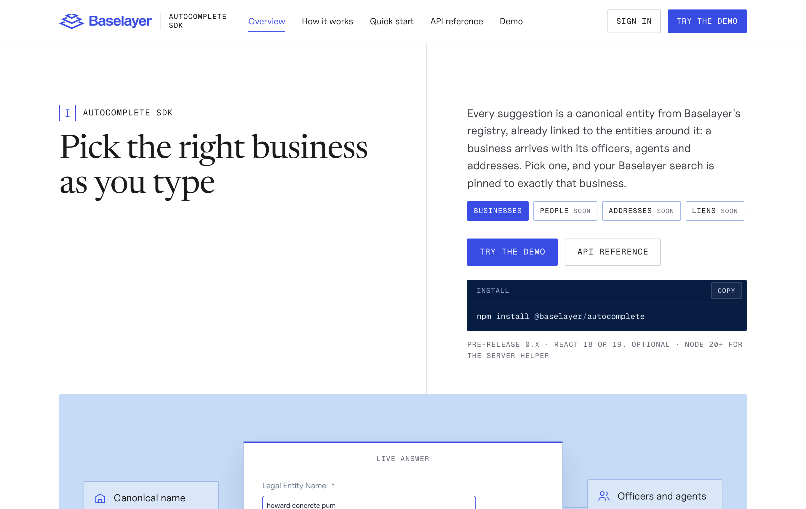
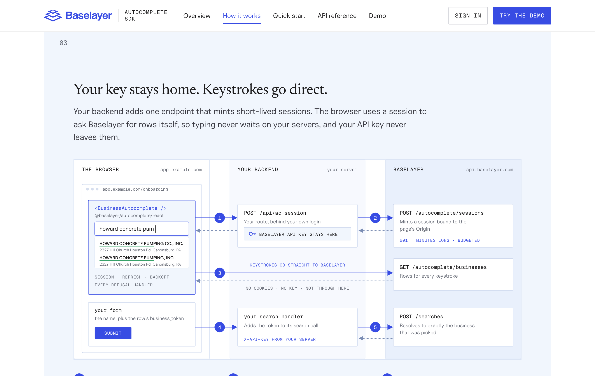
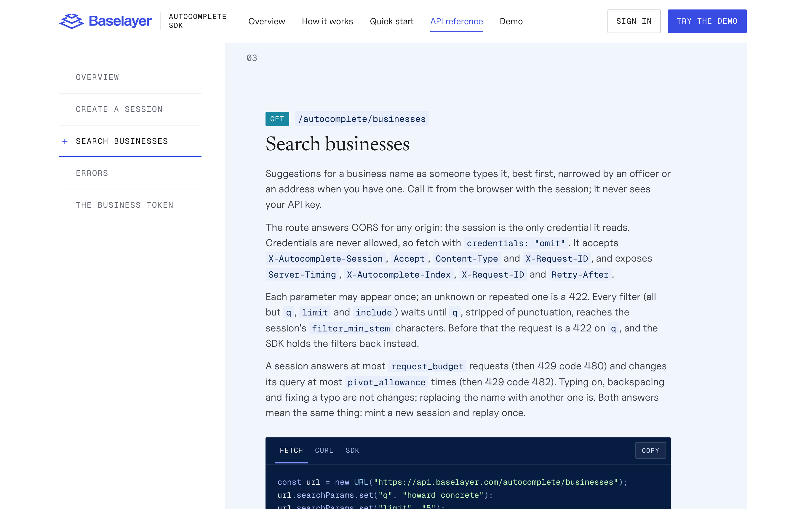

# The site

`site/` builds three static pages in Baselayer's brand:

| Page          | Path     | What                                               |
| ------------- | -------- | -------------------------------------------------- |
| Overview      | `/`      | the entities it searches, how it fits your backend |
| API reference | `/api/`  | the two routes, generated from their specs         |
| Demo          | `/demo/` | the component against your own organization        |



The overview leads with what the autocomplete searches (businesses today;
people, addresses and liens next) and how each result links to the rest,
then explains the integration in two diagrams: where each piece runs, and
every request from focus to submit in three swim lanes, for the browser,
your backend and Baselayer.



## The API reference is generated

Nothing on `/api/` is written by hand in the page. The build assembles one
OpenAPI 3.1 document and the page renders it: its sections come from the
document's tags, its fields from the schemas, its refusals from the
responses, and its examples from `examples` and `x-codeSamples`.

```text
contracts/tier-openapi.json          GET /autocomplete/businesses ─┐
contracts/sessions-openapi.json      POST /autocomplete/sessions  ─┤
contracts/autocomplete.overlay.yaml  what the specs lack          ─┘
                                                                   │ assemble
                          api/openapi.json  ◄── one document  ◄────┘
                          /api/             ◄── + Markdown rendered to HTML
```

- The two specs are the ones osiris-app produces, vendored (see
  [CONTRIBUTING](../CONTRIBUTING.md#contracts)).
- The overlay is an OpenAPI Overlay 1.0 holding what the specs do not say
  yet: the `Origin` rule, the refusal codes, examples. Each action names
  where in osiris-app its text belongs; the goal is an empty overlay.
- `site/api/spec/assemble.ts` does the assembly; `site/api/spec/plugin.ts`
  renders the descriptions from Markdown at build time, so no Markdown
  parser ships to the browser, and publishes the document at
  `api/openapi.json` for anyone who wants it in Postman or a generator.
- A target the overlay names that no longer exists fails the build.



## Running it

```bash
pnpm site        # http://localhost:3000
pnpm demo        # the same server, opened on the demo
pnpm site:build  # site-dist/, static files
```

## Publishing under a Baselayer domain

`site-dist/` is plain static files: serve it from a bucket, a CDN or GitHub
Pages with a custom domain. Every link goes through the base path, so for a
sub-path build with it:

```bash
SITE_BASE=/autocomplete/ pnpm site:build
```

The pages carry their own Content-Security-Policy and load nothing from a
third party; the fonts are self-hosted. Uncut Sans is baselayer.com's own
sans; Newsreader and Geist Mono stand in for its licensed serif and mono,
and can be swapped for them in `site/shared/brand.css` if the licence covers
this site.

The demo on the published page calls the API from the browser, so its
origin must be allowed:

- **Session-token mode** needs only the tier's any-origin CORS (osiris-app
  ENG-7947).
- **API-key mode** needs the page's origin in the API's
  `CORS_NON_SPA_ORIGINS`. ENG-7947 lists the GitHub Pages origin; list the
  new domain there instead.
