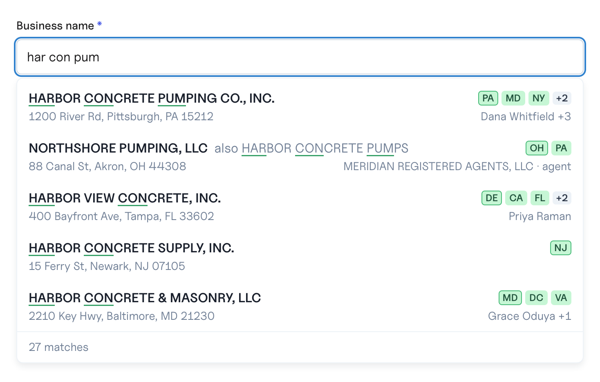

# Styling

Import the stylesheet once:

```ts
import "@baselayer-sdk/autocomplete/react/styles.css";
```

The stylesheet gives the component a complete look out of the box. Four
levers change it, from the lightest to the heaviest.

## 1. `look`

The colors, the match marks and the debug footer, as one prop. Any knob left
out keeps its default; an unusable value (a color that is not hex, an unknown
emphasis) keeps its default too.

```tsx
<BusinessAutocomplete
  look={{
    matchEmphasis: "background",   // plain | weight | ink | underline | background
    matchEmphasisRegion: "substring", // token | substring
    matchEmphasisColor: "#FDE68A",
    titleColor: "#111827",
    pillBackgroundColor: "#DBEAFE",
    pillForegroundColor: "#1E3A8A",
    showDebugInfo: true,           // round trip and index in the footer
  }}
  …
/>
```

| Knob                           | Default       | Sets                                   |
| ------------------------------ | ------------- | -------------------------------------- |
| `matchEmphasis`                | `"underline"` | how the marks are drawn                |
| `matchEmphasisRegion`          | `"token"`     | whole words, or the typed characters   |
| `matchEmphasisColor`           | `null`        | `--bl-ac-mark`                         |
| `backgroundColor`              | `#FFFFFF`     | `--bl-ac-bg`                           |
| `titleColor`                   | `#1A202C`     | `--bl-ac-title`                        |
| `subtitleColor`                | `#718096`     | `--bl-ac-subtitle`                     |
| `pillBackgroundColor`          | `#C6F6D5`     | `--bl-ac-pill-bg`                      |
| `pillForegroundColor`          | `#22543D`     | `--bl-ac-pill-fg`                      |
| `primaryPillBorderColor`       | `#48BB78`     | `--bl-ac-pill-primary-border`          |
| `secondaryPillBackgroundColor` | `#EDF2F7`     | `--bl-ac-pill-secondary-bg`            |
| `showDebugInfo`                | `false`       | the round trip and index in the footer |

Colors are hex: `#rgb`, `#rrggbb` or `#rrggbbaa`. `plain` draws no marks,
`weight` sets the matched words bolder than the rest of the name, `ink`
darker, `underline` underlines them and `background` fills behind them.
`DEFAULT_LOOK` in the core holds these defaults, `resolveLook(look)` lays a
staged look over them as the component does, and `MATCH_EMPHASES` and
`MATCH_REGIONS` list the accepted values.

`substring` marks only the typed characters of each word:



## 2. CSS variables

Set them on `.bl-ac` or any ancestor selector more specific than it:

| Variable                      | Default                            | Paints                                       |
| ----------------------------- | ---------------------------------- | -------------------------------------------- |
| `--bl-ac-bg`                  | `#ffffff`                          | the menu                                     |
| `--bl-ac-title`               | `#1a202c`                          | a row's name                                 |
| `--bl-ac-subtitle`            | `#718096`                          | the second line and `also …`                 |
| `--bl-ac-pill-bg`             | `#c6f6d5`                          | the state squares                            |
| `--bl-ac-pill-fg`             | `#22543d`                          | their letters                                |
| `--bl-ac-pill-primary-border` | `#48bb78`                          | the domicile's border                        |
| `--bl-ac-pill-secondary-bg`   | `#edf2f7`                          | the `+N` square                              |
| `--bl-ac-more-fg`             | `#2d3748`                          | the `+N` square's text                       |
| `--bl-ac-highlight-bg`        | `#edf2f7`                          | the highlighted row                          |
| `--bl-ac-border`              | `#edf2f7`                          | the menu border, the footer rule             |
| `--bl-ac-mark`                | unset                              | every mark, when set                         |
| `--bl-ac-underline`           | `#38a169`                          | the underline mark                           |
| `--bl-ac-marker`              | `#c6f6d5`                          | the background mark                          |
| `--bl-ac-ink-mark`            | unset: the title's color           | a matched word, under `ink`                  |
| `--bl-ac-ink-base`            | `#4a5568`                          | the name's unmatched text, under `ink`       |
| `--bl-ac-also-mark`           | `#2d3748`                          | the `also …` marks, under `weight` and `ink` |
| `--bl-ac-radius`              | `0.5rem`                           | the menu                                     |
| `--bl-ac-pill-radius`         | `0.25rem`                          | the state and `+N` squares                   |
| `--bl-ac-shadow`              | `0 4px 8px rgba(16, 24, 40, 0.08)` | the menu                                     |
| `--bl-ac-z`                   | `1000`                             | the menu's stacking                          |
| `--bl-ac-menu-width`          | `560px`                            | a menu that keeps its own width              |
| `--bl-ac-list-max-height`     | `24rem`                            | the scrolling list                           |
| `--bl-ac-line-height`         | `1.5`                              | every line in the menu                       |

Under the `weight` emphasis, the name's own marks take `--bl-ac-mark` only
when `look.matchEmphasisColor` sets it; set in your CSS alone, it colors the
alternative name's marks there and not the name's.

```css
.my-form .bl-ac {
  --bl-ac-title: var(--brand-ink);
  --bl-ac-radius: 12px;
}
```

The component writes a variable inline only for a `look` knob that differs
from the default, so variables you set in CSS are not overridden.

Four colors are not variables: the default input's white fill, `#cbd5e0`
border and `#3182ce` focus ring, and the footer's `#718096` text, which does
not follow `--bl-ac-subtitle`. Restyle them on `.bl-ac-input` and
`.bl-ac-footer`.

The menu is as wide as the input. `menuFollowsInputWidth={false}` gives it a
width of its own from 48em up, `--bl-ac-menu-width`; below that it is the
input's width either way.

## 3. Class names and render props

Every element has a `bl-ac-*` class, and `classNames` adds yours per slot:
`root`, `label`, `input`, `menu`, `list`, `row`, `titleLine`, `name`,
`also`, `mark`, `states`, `state`, `moreStates`, `subtitleLine`, `address`,
`people`, `footer`, `count`, `debug`.

Each slot's class is `bl-ac-` and the slot's name in kebab case (`moreStates`
is `bl-ac-more-states`), except `root`, which is `bl-ac`, and the two lines:
both are `bl-ac-line`, and `titleLine` adds `bl-ac-line-title`,
`subtitleLine` `bl-ac-line-subtitle`.

```tsx
<BusinessAutocomplete
  classNames={{ row: "my-row", footer: "my-footer" }}
  renderInput={props => <TextField {...props} size="sm" />}
  renderLabel={props => <FormLabel {...props}>Legal name</FormLabel>}
  renderRow={({ item, defaultRow }) => (
    <>
      {defaultRow}
      <small>{item.match}</small>
    </>
  )}
  …
/>
```

`renderInput` and `renderLabel` receive the props that wire the combobox:
spread them onto your input and label, ref included. The props carry no
class: `classNames.input` and `classNames.label` reach only the default input
and label. `renderRow` gets `{ item, index, highlighted, defaultRow }`, and
what it returns goes inside the row's option element, which keeps its class,
`data-highlighted` and the combobox's item props.

The stylesheet's base rules are one class deep. A global reset has lower
specificity and never wins; your class loaded after the stylesheet wins a
tie; a selector two classes deep wins against a base rule. States and
variants add an attribute or a pseudo-class (`.bl-ac-row[data-highlighted]`,
`.bl-ac-input:focus-visible`), and the marks sit under the name's emphasis
(`.bl-ac-name[data-emphasis="underline"] .bl-ac-mark`): restyle those with a
selector at least as specific as theirs, loaded after the stylesheet.

## 4. `unstyled`

`unstyled` emits no `bl-ac-*` class at all. The `data-*` attributes stay
(`data-open` on the menu, and `data-width="fixed"` with
`menuFollowsInputWidth={false}`; `data-highlighted` on a row; `data-domicile`
on the domicile's square; `data-emphasis` and `data-region` on the root and
the name, and `data-mark-color` on the root when `look.matchEmphasisColor` is
set; `data-slot="left"` or `"right"` on the name, the states, the address and
the people, and `data-role="officer"` or `"agent"` on the people; `data-rows`
on the footer when rows sit above it), and `classNames` still applies, so you
can style every slot yourself. Position the menu yourself too: it is the
element with `data-testid="autocomplete-menu"`.

Past that, drop the component and build on the hooks: see
[Headless use](headless.md).

## 5. A row's parts

A row has four parts, named for what they are on any entity rather than on
a business:

| Part                | On a business                                  |
| ------------------- | ---------------------------------------------- |
| `title`             | the name, and an alternative name that matched |
| `flags`             | the states, the domicile first                 |
| `subtitle`          | the lead address                               |
| `secondarySubtitle` | the officers, or the registered agent          |

They sit in four places: the title and the flags on the first line, the
subtitle and the secondary subtitle on the second. The title always shows: a
row is the entity it names. `parts` leaves any of the other three out; each
shows unless set to `false`. With the subtitle left out, the secondary
subtitle is promoted to its place, so no line starts with a gap. Every row of
a menu shares one layout, so its columns line up; a row without a part (no
officers) leaves that part's place empty.

```tsx
<BusinessAutocomplete parts={{ flags: false, secondarySubtitle: false }} … />
```

The parts also decide what is fetched. Leaving the subtitle out stops the
addresses being asked for, and leaving the secondary subtitle out the
people (officers and registered agents), so a row arrives with only what it
shows (`includeForParts(resolveParts(parts))` in the core says what a set of
parts asks for: `resolveParts` fills in every part of `ROW_PARTS` not set to
`false`). Leaving both out is the exception:
the tier refuses an empty `include`, so none is sent and its default, people
and addresses, stands. A form that fills an address from the pick keeps the
subtitle.

## 6. Previewing a style

`open` holds the menu open whatever focus does, so a style can be judged
without typing and retyping. It shows only what there is to show: rows, or
the count row once there is something to count. Letting go of it leaves the
menu open or closed as it would have been.

To style rows before any are fetched, draw `BusinessAutocompleteView` (the
component without its data) with rows of your own, the way the live demo
does:

```tsx
import { BusinessAutocompleteView } from "@baselayer-sdk/autocomplete/react";

<BusinessAutocompleteView
  id="preview"
  value="harbor concr"
  onInputChange={() => {}}
  onSelect={() => {}}
  suggestions={sampleRows}
  found={27}
  foundCapped={false}
  truncated={false}
  indexTag={null}
  roundTripMs={42}
  isSearching={false}
  error={null}
  look={look}
  open
/>;
```

The view draws what it is given and fetches nothing. Its count row shows only
while `isSearching`, when `error` is set, or once `roundTripMs` is not null,
so a preview with `roundTripMs={null}` has none. It reads "Searching…" while
searching with no rows yet, `error`'s text in place of the count, or the
`found` matches (`N+` with `foundCapped`); with `truncated`, a note that the
tier did not finish looking takes the count's place. `onSelect` hands over
the picked row and leaves the input to you. The view also takes the
component's `label`, `renderLabel`, `renderInput`, `renderRow`, `classNames`,
`unstyled`, `parts`, `menuFollowsInputWidth` and `messages`, and `inputName`,
`inputRef`, `onInputFocus` and `onInputBlur` for its input.

Give it the query your rows pretend was typed, as the demo gives its sample
rows `"harbor concr"`: the `substring` region cuts each marked word down to
the typed characters, so with nothing typed a row's marks cover its matched
words whole under either region.
