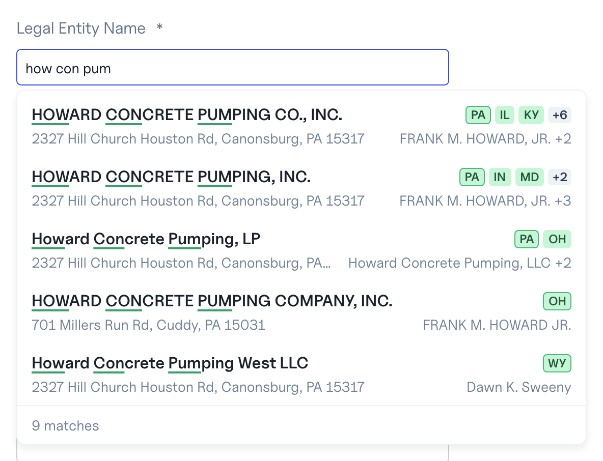

# Styling

Import the stylesheet once:

```ts
import "@baselayer/autocomplete/react/styles.css";
```

Out of the box the component looks like the Baselayer console. Four levers
change it, from the lightest to the heaviest.

## 1. `look`

The same knobs the Baselayer console reads, as a prop. Any knob left out
keeps its default; an unusable value (a colour that is not hex, an unknown
emphasis) keeps its default too.

```tsx
<BusinessAutocomplete
  look={{
    matchEmphasis: "background",   // plain | weight | ink | underline | background
    matchEmphasisRegion: "substring", // token | substring
    matchEmphasisColor: "#FDE68A",
    titleColor: "#111827",
    pillBackgroundColor: "#DBEAFE",
    pillForegroundColor: "#1E3A8A",
    showDebugInfo: true,           // round trip and index in the footer
  }}
  …
/>
```

`substring` marks only the typed characters of each word:



## 2. CSS variables

Set them on `.bl-ac` or any ancestor selector more specific than it:

| Variable                      | Default                            | Paints                           |
| ----------------------------- | ---------------------------------- | -------------------------------- |
| `--bl-ac-bg`                  | `#ffffff`                          | the menu                         |
| `--bl-ac-title`               | `#1a202c`                          | a row's name                     |
| `--bl-ac-subtitle`            | `#718096`                          | the second line and `also …`     |
| `--bl-ac-pill-bg`             | `#c6f6d5`                          | the state squares                |
| `--bl-ac-pill-fg`             | `#22543d`                          | their letters                    |
| `--bl-ac-pill-primary-border` | `#48bb78`                          | the domicile's border            |
| `--bl-ac-pill-secondary-bg`   | `#edf2f7`                          | the `+N` square                  |
| `--bl-ac-highlight-bg`        | `#edf2f7`                          | the highlighted row              |
| `--bl-ac-border`              | `#edf2f7`                          | the menu border, the footer rule |
| `--bl-ac-mark`                | unset                              | every mark, when set             |
| `--bl-ac-underline`           | `#38a169`                          | the underline mark               |
| `--bl-ac-marker`              | `#faf089`                          | the background mark              |
| `--bl-ac-radius`              | `0.5rem`                           | the menu                         |
| `--bl-ac-shadow`              | `0 4px 8px rgba(16, 24, 40, 0.08)` | the menu                         |
| `--bl-ac-z`                   | `1000`                             | the menu's stacking              |
| `--bl-ac-menu-width`          | `560px`                            | the menu from 48em up            |
| `--bl-ac-list-max-height`     | `24rem`                            | the scrolling list               |
| `--bl-ac-line-height`         | `1.5`                              | every line in the menu           |

```css
.my-form .bl-ac {
  --bl-ac-title: var(--brand-ink);
  --bl-ac-radius: 12px;
}
```

The component writes a variable inline only for a `look` knob that differs
from the default, so variables you set in CSS are not overridden.

## 3. Class names and render props

Every element has a `bl-ac-*` class, and `classNames` adds yours per slot:
`root`, `label`, `input`, `menu`, `list`, `row`, `titleLine`, `name`,
`also`, `mark`, `states`, `state`, `moreStates`, `subtitleLine`, `address`,
`people`, `footer`, `count`, `debug`.

```tsx
<BusinessAutocomplete
  classNames={{ input: "form-control", row: "my-row" }}
  renderInput={props => <TextField {...props} size="sm" />}
  renderLabel={props => <FormLabel {...props}>Legal name</FormLabel>}
  renderRow={({ item, defaultRow }) => (
    <>
      {defaultRow}
      <small>{item.match}</small>
    </>
  )}
  …
/>
```

`renderInput` and `renderLabel` receive the props that wire the combobox:
spread them onto your input and label, ref included.

The stylesheet's rules are all one class deep. A global reset has lower
specificity and never wins; your class loaded after the stylesheet wins a
tie; a selector two classes deep always wins.

## 4. `unstyled`

`unstyled` emits no `bl-ac-*` class at all. The `data-*` attributes stay
(`data-open` on the menu, `data-highlighted` on a row, `data-domicile` on
the domicile's square, `data-emphasis` and `data-region` on the name), and
`classNames` still applies, so you can style every slot yourself. Position
the menu yourself too: it is the element with `data-testid="autocomplete-menu"`.

Past that, drop the component and build on the hooks: see
[Headless use](headless.md).
