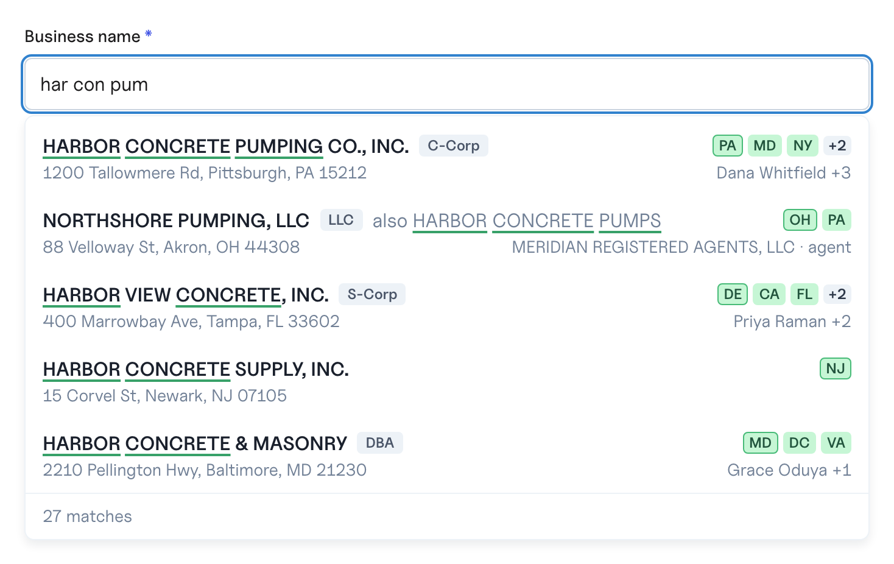

# Styling

Import the stylesheet once:

```ts
import "@baselayer-sdk/autocomplete/react/styles.css";
```

The stylesheet gives the components a complete look out of the box. Four
levers change it, from the lightest to the heaviest, and each works the same
on `BusinessAutocomplete`, `PersonAutocomplete` and `AddressAutocomplete`.
The row's places and fields (section 5) are the business row's; a person's or
an address's row has the fixed shape under
[Person and address rows](#person-and-address-rows).

## 1. `look`

The colors, the match marks and the debug footer, as one prop. Any knob left
out keeps its default; an unusable value (a color that is not hex, an unknown
emphasis) keeps its default too.

```tsx
<BusinessAutocomplete
  look={{
    matchEmphasis: "background",   // plain | weight | ink | underline | background
    matchEmphasisRegion: "substring", // token | substring
    matchEmphasisColor: "#FDE68A",
    titleColor: "#111827",
    pillBackgroundColor: "#DBEAFE",
    pillForegroundColor: "#1E3A8A",
    showDebugInfo: true,           // round trip and index in the footer
  }}
  …
/>
```

| Knob                           | Default       | Sets                                              |
| ------------------------------ | ------------- | ------------------------------------------------- |
| `matchEmphasis`                | `"underline"` | how the marks are drawn                           |
| `matchEmphasisRegion`          | `"substring"` | the typed characters, or whole words              |
| `matchEmphasisColor`           | `null`        | `--bl-ac-mark`                                    |
| `backgroundColor`              | `#FFFFFF`     | `--bl-ac-bg`                                      |
| `titleColor`                   | `#1A202C`     | `--bl-ac-title`                                   |
| `subtitleColor`                | `#718096`     | `--bl-ac-subtitle`                                |
| `pillBackgroundColor`          | `#C6F6D5`     | `--bl-ac-pill-bg`                                 |
| `pillForegroundColor`          | `#22543D`     | `--bl-ac-pill-fg`                                 |
| `primaryPillBorderColor`       | `#48BB78`     | `--bl-ac-pill-primary-border`                     |
| `secondaryPillBackgroundColor` | `#EDF2F7`     | `--bl-ac-pill-secondary-bg`                       |
| `structurePillBackgroundColor` | `#EDF2F7`     | `--bl-ac-structure-bg`                            |
| `structurePillForegroundColor` | `#4A5568`     | `--bl-ac-structure-fg`                            |
| `showDebugInfo`                | `false`       | the round trip and index in the footer            |
| `disabledDim`                  | `0.6`         | how far a disabled line under a row fades, 0 to 1 |

Colors are hex: `#rgb`, `#rrggbb` or `#rrggbbaa`. `plain` draws no marks,
`weight` sets the matched words bolder than the rest of the name, `ink`
darker, `underline` underlines them and `background` fills behind them. The
same treatment marks what a filter matched: an officer and an address, whole,
since the autocomplete service sends no parts for them, and a state's square
(see [what matched](#what-matched)). `matchEmphasisRegion` applies to the
name's words only.
`DEFAULT_LOOK` in the core holds these defaults, `resolveLook(look)` lays a
staged look over them as the component does, and `MATCH_EMPHASES` and
`MATCH_REGIONS` list the accepted values.

`substring`, the default, marks only the characters typed of each word;
`token` marks the whole word a typed token begins, as the autocomplete service
sends it:



## 2. CSS variables

Set them on `.bl-ac` or any ancestor selector more specific than it:

| Variable                      | Default                            | Paints                                       |
| ----------------------------- | ---------------------------------- | -------------------------------------------- |
| `--bl-ac-bg`                  | `#ffffff`                          | the menu                                     |
| `--bl-ac-title`               | `#1a202c`                          | a row's name                                 |
| `--bl-ac-subtitle`            | `#718096`                          | the address, the people and `also …`         |
| `--bl-ac-pill-bg`             | `#c6f6d5`                          | the state squares                            |
| `--bl-ac-pill-fg`             | `#22543d`                          | their letters                                |
| `--bl-ac-pill-primary-border` | `#48bb78`                          | the domicile's border                        |
| `--bl-ac-pill-secondary-bg`   | `#edf2f7`                          | the `+N` square                              |
| `--bl-ac-structure-bg`        | `#edf2f7`                          | the structure's flag                         |
| `--bl-ac-structure-fg`        | `#4a5568`                          | its letters                                  |
| `--bl-ac-more-fg`             | `#2d3748`                          | the `+N` square's text                       |
| `--bl-ac-highlight-bg`        | `#edf2f7`                          | the highlighted row                          |
| `--bl-ac-border`              | `#edf2f7`                          | the menu border, the footer rule             |
| `--bl-ac-mark`                | unset                              | every mark, when set                         |
| `--bl-ac-underline`           | `#38a169`                          | the underline mark                           |
| `--bl-ac-marker`              | `#c6f6d5`                          | the background mark                          |
| `--bl-ac-ink-mark`            | unset: the title's color           | a matched word, under `ink`                  |
| `--bl-ac-ink-base`            | `#4a5568`                          | the name's unmatched text, under `ink`       |
| `--bl-ac-also-mark`           | `#2d3748`                          | the `also …` marks, under `weight` and `ink` |
| `--bl-ac-radius`              | `0.5rem`                           | the menu                                     |
| `--bl-ac-pill-radius`         | `0.25rem`                          | the state and `+N` squares, and the flag     |
| `--bl-ac-shadow`              | `0 4px 8px rgba(16, 24, 40, 0.08)` | the menu                                     |
| `--bl-ac-z`                   | `1000`                             | the menu's stacking                          |
| `--bl-ac-menu-width`          | `560px`                            | a menu that keeps its own width              |
| `--bl-ac-list-max-height`     | `24rem`                            | the scrolling list                           |
| `--bl-ac-line-height`         | `1.5`                              | every line in the menu                       |
| `--bl-ac-font`                | unset: the page's font             | the component's font family                  |
| `--bl-ac-name-weight`         | `600`                              | the name, under every emphasis but `weight`  |
| `--bl-ac-weight-base`         | `500`                              | the name's unmatched text, under `weight`    |
| `--bl-ac-weight-mark`         | `700`                              | every matched word, under `weight`           |

A weight the font does not have is drawn in the nearest one it does, so a
heavier `--bl-ac-weight-mark` needs the font loaded in that weight. To use a
font of your own, load it in the page (a font service's `<link>`, or your
own `@font-face` rules) and name it in `--bl-ac-font`:

```css
.my-form .bl-ac {
  --bl-ac-font: "Inter", system-ui, sans-serif;
  --bl-ac-weight-mark: 800;
}
```

Under the `weight` emphasis, the name's own marks take `--bl-ac-mark` only
when `look.matchEmphasisColor` sets it; set in your CSS alone, it colors the
alternative name's marks there and not the name's.

```css
.my-form .bl-ac {
  --bl-ac-title: var(--brand-ink);
  --bl-ac-radius: 12px;
}
```

The component writes a variable inline only for a `look` knob that differs
from the default, so variables you set in CSS are not overridden.

Four colors are not variables: the default input's white fill, `#cbd5e0`
border and `#3182ce` focus ring, and the footer's `#718096` text, which does
not follow `--bl-ac-subtitle`. Restyle them on `.bl-ac-input` and
`.bl-ac-footer`.

The menu is as wide as the input. `menuFollowsInputWidth={false}` gives it a
width of its own from 48em up, `--bl-ac-menu-width`; below that it is the
input's width either way.

## 3. Class names and render props

Every element has a `bl-ac-*` class, and `classNames` adds yours per slot:
`root`, `label`, `input`, `menu`, `list`, `row`, `titleLine`, `title`,
`nameGroup`, `name`, `also`, `mark`, `structure`, `states`, `state`,
`moreStates`, `subtitleLine`, `corner`, `address`, `people`, `footer`,
`count`, `debug`, and on a person's or an address's row `group`,
`groupHead`, `groupLine`, `lineName`, `counts`, `role`, `more`, and under
its field after a pick, `selection`. The title
holds the name group (the name and the badge pinned to its end) and
`also …`; each line's other corners are `corner`.

Each slot's class is `bl-ac-` and the slot's name in kebab case (`moreStates`
is `bl-ac-more-states`), except `root`, which is `bl-ac`, and the two lines:
both are `bl-ac-line`, and `titleLine` adds `bl-ac-line-title`,
`subtitleLine` `bl-ac-line-subtitle`.

```tsx
<BusinessAutocomplete
  classNames={{ row: "my-row", footer: "my-footer" }}
  renderInput={props => <TextField {...props} size="sm" />}
  renderLabel={props => <FormLabel {...props}>Legal name</FormLabel>}
  renderRow={({ item, defaultRow }) => (
    <>
      {defaultRow}
      <small>{item.match}</small>
    </>
  )}
  …
/>
```

`renderInput` and `renderLabel` receive the props that wire the combobox:
spread them onto your input and label, ref included. The props carry no
class: `classNames.input` and `classNames.label` reach only the default input
and label. `renderRow` gets `{ item, index, highlighted, defaultRow }`, and
what it returns goes inside the row's option element, which keeps its class,
`data-highlighted` and the combobox's item props.

The stylesheet's base rules are one class deep. A global reset has lower
specificity and never wins; your class loaded after the stylesheet wins a
tie; a selector two classes deep wins against a base rule. States and
variants add an attribute or a pseudo-class (`.bl-ac-row[data-highlighted]`,
`.bl-ac-input:focus-visible`), and the marks sit under the emphasis of the
name or the alternative name
(`.bl-ac-name[data-emphasis="underline"] .bl-ac-mark`), as do those of a
matched officer or address (`.bl-ac-people[data-emphasis="underline"]
.bl-ac-mark`) and the squares of a matched state (`.bl-ac[data-emphasis=
"underline"] .bl-ac-state[data-matched]`): restyle those with a selector at
least as specific as theirs, loaded after the stylesheet.

## 4. `unstyled`

`unstyled` emits no `bl-ac-*` class at all. The `data-*` attributes stay
(`data-open` on the menu, and `data-width="fixed"` with
`menuFollowsInputWidth={false}`; `data-highlighted` on a row; `data-domicile`
on the domicile's square; `data-emphasis` and `data-region` on the root and
the name, `data-emphasis` on the alternative name, the address and the
people, and `data-mark-color` on the root when `look.matchEmphasisColor` is
set; `data-place` on the title
and on every field, naming the place it is drawn in, and `data-corner`,
`data-text` and `data-flag` on the corners (see
[A row's places and fields](#5-a-rows-places-and-fields)), and
`data-role="officer"` or `"agent"` on the people; `data-matched="true"` on
the people, the address and the state squares a filter matched; `data-rows`
on the footer when rows sit above it), and `classNames` still applies, so you
can style every slot yourself. Position the menu yourself too: it is the
element with `data-testid="autocomplete-menu"`.

Past that, drop the component and build on the hooks: see
[Headless use](headless.md).

### A business row's lines

With `list`, a business row draws its officers and agents (`people`) and its
addresses (`addresses`) under it, as a person's row draws its businesses:
the row as it always was is the group's head, and each item a line
(`bl-ac-group-line`, `data-line` `person` or `address`). A business row that
lists nothing draws exactly as before. The head keeps `ROW_PLACES` and
`ROW_FIELDS`; each line has the three places after its name every listed
line has (`BUSINESS_ROW`):

| Place                                  | Default       | Can show                                                           |
| -------------------------------------- | ------------- | ------------------------------------------------------------------ |
| `personBadge`, `personTrailingBadge`   | empty         | `personRole`: officer or agent (`messages.personRoles`)            |
| `personTrailing`                       | `personRole`  | `personRole`                                                       |
| `addressBadge`, `addressTrailingBadge` | empty         | `addressRole`: how the business holds it (`messages.addressRoles`) |
| `addressTrailing`                      | `addressRole` | `addressRole`                                                      |

A line's fields go only on that line, and the head's only in the head;
placed anywhere else, a field counts as left out. To draw each officer's
role right after their name:

```tsx
<BusinessAutocomplete
  list={["people"]}
  layout={{ personBadge: "personRole" }}
  …
/>
```

The role moved, `personTrailing` is left empty, as a field placed elsewhere
always leaves its default place.

### Person and address rows

A person or an address is a group in the menu (`bl-ac-group`,
`role="group"`, labelled by its name and described by its counts and what
its lists leave out). Its head (`bl-ac-group-head`) is the name, marked as a
business's is (`bl-ac-name`). Below it, indented, is a line
(`bl-ac-group-line`, `data-line` its type) for each business, address or
person listed under it (`list`), its name in `bl-ac-line-name`. Every
line, the head too, is its lead (the name, after its icon, then its badge:
`bl-ac-group-lead`) and its trailing corner (`bl-ac-group-trailing`). By
default:

```text
Jane Q Doe   12 Fernhallow Ln, Dover, DE 19901 +2 ........ 3 businesses · 3 addresses
  ACME HOLDINGS LLC   1200 Tallowmere Rd, Wilm… ............ [DE][FL] +1   officer
  12 Fernhallow Ln, Dover, DE 19901 .................................... officer
```

The last line is there when `list` names addresses. Each line's places are
`<line>Badge`, `<line>TrailingBadge` and `<line>Trailing` (`headBadge`,
`businessTrailing`, …), listed in `PERSON_ROW` and `ADDRESS_ROW`, and
`layout` fills them as it does a business row's, each place taking only its
own line's fields:

| Field          | Line                 | Draws                                                                                    |
| -------------- | -------------------- | ---------------------------------------------------------------------------------------- |
| `firstAddress` | a person's head      | their first address, then `+N` for the rest (`bl-ac-address`)                            |
| `counts`       | the head             | each relation's full count, `·` between (`bl-ac-group-count`: `messages.relationCounts`) |
| `address`      | a business           | the business's lead address (`bl-ac-address`)                                            |
| `states`       | a business           | its states as squares, the domicile first (`bl-ac-states`)                               |
| `role`         | a business           | the person's role on it, or how it holds the address (`bl-ac-role`)                      |
| `addressRole`  | an address, a person | the person's role at it (`bl-ac-role`)                                                   |
| `personRole`   | a person, an address | the person's role at the address (`bl-ac-role`)                                          |

Every listed line is an option. One the host enabled (`enabledLines`) has
`data-enabled`, and `data-highlighted` while the keys or the pointer are on
it; any other is disabled, `aria-disabled="true"`, and the keys pass over it.
A list ends, fainter, in how many it leaves out (`bl-ac-more`:
`messages.moreNotShown`). Groups after the first have a rule above them in
`--bl-ac-border`. `look` colours them as it does a business's row: the names
in `titleColor`, addresses, counts and roles in `subtitleColor`, the
highlighted line on `--bl-ac-highlight-bg`.

On the lines under a row, a name is a step smaller than the row's own, and the
states and the role are columns: the states as wide as three squares and a `+N`,
the role as wide as the menu's longest (`--bl-ac-role-chars`) and a step
quieter, so the squares start at one edge down the group.

A disabled line under a row reads as inactive: all of it loses its colour
(`--bl-ac-disabled-filter`), its name and its other text fade toward the menu's
ground (`--bl-ac-disabled-name`, `--bl-ac-disabled-text`, the icon with the
text), and its state squares dim (`--bl-ac-disabled-opacity`).
`look.disabledDim` sets how far, 0 for none, and the component works the inks
out from the look's colours. WCAG exempts an inactive component from its
contrast minimum, so the fade is deliberately strong, with floors that keep it
legible on any colours: a disabled name keeps 4.6:1 by the formula, which draws
at 3:1 or more once antialiasing has its share, and the rest keeps 40% of its
contrast and at least 1.8:1, drawing at about half an enabled line's. A colour
set only in CSS, not through `look`, fades by the default look's shares
(`color-mix`), without the floors. A translucent title or subtitle is faded as
it is drawn on the ground; a translucent background shows whatever is under the
menu, which the component cannot know, so the floors then hold only on the
background's own colour. A pick and the row's head do not fade, and nothing
fades under forced colours.

After a pick from a line under a row, the line under the field
(`bl-ac-selection`, `data-type` the picked line's type) names what was
picked, in `subtitleColor`.

### Icons

An icon rides on a segment, a name or a field, wherever the layout puts it
([Icons](entities.md#icons) says which and how to choose them). It is
`bl-ac-icon`, hidden from screen readers, with `data-entity` its entity,
`data-role` its role where the row knows one, and `data-glyph` the SDK's
glyph it draws (`building`, `person`, `pin`, `envelope`, `briefcase`,
`house`; none for your own). It is drawn in `subtitleColor` at the size of
its text, centred on its line. On a name it sits just before the name; on a
field (an address, the people) it is the field's first child, kept
`0.4em` from the text, which gives way after it.

```css
/* A mailing address's envelope in the brand colour. */
.my-form .bl-ac-icon[data-glyph="envelope"] {
  color: var(--brand-ink);
}
```

## 5. A row's places and fields

A row has places, named for where they sit, and fields, what a business has
to show. `layout` picks the field each place shows:

```text
┌────────────────────────────────────────────────────────────────────┐
│ title · titleBadge              titleTrailingBadge · titleTrailing │
│ subtitle · subtitleBadge  subtitleTrailingBadge · subtitleTrailing │
└────────────────────────────────────────────────────────────────────┘
  HARBOR CONCRETE PUMPING CO., INC. [C-Corp]          PA MD NY +2
  1200 Tallowmere Rd, Pittsburgh, PA 15212             Dana Whitfield +3
```

| Place                   | Where                                    | Default                              |
| ----------------------- | ---------------------------------------- | ------------------------------------ |
| `title`                 | line 1, leading                          | the name, and `also …`; always shown |
| `titleBadge`            | line 1, pinned to the end of the name    | `structure`                          |
| `titleTrailingBadge`    | line 1, pinned before `titleTrailing`    | empty                                |
| `titleTrailing`         | line 1, right-aligned                    | `states`                             |
| `subtitle`              | line 2, leading                          | `address`                            |
| `subtitleBadge`         | line 2, pinned after `subtitle`          | empty                                |
| `subtitleTrailingBadge` | line 2, pinned before `subtitleTrailing` | empty                                |
| `subtitleTrailing`      | line 2, right-aligned                    | `people`                             |

Each corner of a row, a line's lead or its right, is a field and a badge
pinned to its inner side. Any field goes in any place, a badge place
included: `{ titleBadge: null, subtitleTrailingBadge: "structure" }` draws
the structure's flag just before the officers.

| Field       | Draws                                                 |
| ----------- | ----------------------------------------------------- |
| `states`    | the state squares, the domicile first, then `+N`      |
| `structure` | the structure's flag (below)                          |
| `address`   | the lead address, or "No address on file"             |
| `people`    | the officers, or the registered agent, marked as such |

```tsx
<BusinessAutocomplete
  layout={{ titleBadge: null, subtitle: "people", subtitleTrailing: "states" }}
  …
/>
```

`layout` maps a place to a field, or to `null` for an empty place. A place
left out keeps its default field, unless you placed that field elsewhere:
`{ subtitle: "states" }` moves the states and leaves `titleTrailing` empty. A
field is drawn in one place at most; placed twice, it stays in the first
place in reading order and the later one is left empty. In the core,
`resolveRowLayout(layout)` returns the complete layout, every place with its
field or `null`; `drawnRowLayout(resolved)` moves the fields to where the
row draws them (below); `DEFAULT_ROW_LAYOUT` is the default;
`ROW_PLACES` (in reading order) and `ROW_FIELDS` list the places and the
fields, and `ROW_LINES` groups the places into each line's two corners.

A field looks the same in any place; its corner decides where it sits and
what gives way first. Each line is two corners, its lead and its trailing
corner, each a field with its badge pinned to the side facing the middle of
the row; the first line's lead is the title.

- The lead takes the room the trailing corner leaves it, and gives way
  first. The trailing corner keeps to the right at its own width, so its
  column lines up down the menu.
- In a corner, text gives way, ellipsised down to nothing, and a flag keeps
  its width: a corner is never narrower than its flags, and no line is
  wider than the menu, whatever the layout.
- Text at the right keeps its width while text in the lead can give way, up
  to a cap that leaves the lead some room: half the first line, so the name
  keeps the rest, or all but about 5rem of the second. Beside a lead with no
  text, a flag or nothing, it takes the rest of the line. A second-line lead
  that pins a flag beside its text has spent that room on the flag, so it
  shares the line with the text at the right, each giving way in proportion.
- The badge sits at the end of the name, before `also …`. When the first
  line runs out of room, `also …` gives way first: it is ellipsised down to
  6em, then leaves the line whole rather than shrinking to a stray letter.
  Then the name is ellipsised; the badge and the trailing corner stay.
- Text sits on the line's baseline, whatever its size; on the first line, a
  flag, and a corner of flags, is centred on the line.
- Every row of a menu shares one layout, so its columns line up; a row
  without a field (no officers) leaves that field's place empty, and draws
  no corner where it has nothing to put.
- A badge beside an empty field is drawn as that field, so no badge is
  pinned beside nothing. With `subtitle` empty, the second line's right
  corner, its badge and all, is drawn in its place, so the line never starts
  with a gap. A line with nothing in any of its places is dropped.

Each line holds its corners: the title, then `.bl-ac-corner` elements with
`data-corner="lead"` or `"trailing"`, marked `data-text` when they hold text
on that row and `data-flag` when they hold a flag. Each field's element says
where it is drawn,
`data-place="titleBadge"` and so on, and the title's says
`data-place="title"`.

The placed fields also decide what is fetched: `address` asks for the
addresses and `people` for the people (officers and registered agents),
while the states and the structure come on the row itself.
`includeForLayout(layout)` in the core says what a layout asks for. With
neither placed, the autocomplete service refuses an empty `include`, so none is
sent and its default, people and addresses, stands. A form that fills an address
from the pick keeps the address placed. A relation `list` lists is asked for
too, whatever the layout places. `include` on `BusinessAutocomplete` asks for
what it names instead: rows you draw with `renderRow` name what they read,
`include={["people"]}`.

### Every kind of row

A business row's head is one kind of row among three, and they share one
model. `ROW_KINDS` holds each search's: `BUSINESS_ROW`, `PERSON_ROW` and
`ADDRESS_ROW`. Each is a `RowKind`:

| Member         | What it is                                                                               |
| -------------- | ---------------------------------------------------------------------------------------- |
| `places`       | Its places in reading order (`BUSINESS_ROW_PLACES`, `PERSON_ROW_PLACES`, …)              |
| `fields`       | Every field a place can show, by line in `BUSINESS_LINE_FIELDS`, `PERSON_LINE_FIELDS`, … |
| `lines`        | Its lines: each line's two corners, the `entity` it draws and the `relation` it lists    |
| `defaults`     | The field each place shows when a layout leaves it out                                   |
| `accepts`      | Which fields a place may hold: its own line's                                            |
| `iconSegments` | The segments an icon can ride on (`BUSINESS_ICON_SEGMENTS`, …)                           |

A line's `entity` is what it draws, and so what `enabledLines` names to
enable it; its `relation` is the relation it lists, one line per item, null
on the row's head. Every listed line has the same three places after its
name, named for its line: `<line>Badge`, `<line>TrailingBadge` and
`<line>Trailing`. A row's segments are its fields and its names: `name` for
the row's own, `<line>Name` for each listed line's.

`resolveLayout(kind, layout)` and `drawnLayout(kind, resolved)` do for any
kind what `resolveRowLayout` and `drawnRowLayout` do for a business row's
head, with the same rules: a place left out keeps its default unless its
field went elsewhere, a field is drawn once, and a badge beside an empty
field is drawn as that field.

```ts
import {
  ROW_KINDS,
  drawnLayout,
  requestFor,
  resolveLayout,
} from "@baselayer-sdk/autocomplete";

const kind = ROW_KINDS.people;
const layout = drawnLayout(
  kind,
  resolveLayout(kind, { businessTrailing: null }),
);
layout.businessTrailing; // "states": the role gone, the states move over

requestFor("people", layout, ["businesses"]);
// { list: ["businesses"], include: ["businesses", "addresses"] }:
// the head's first address and counts need the addresses too
```

`requestFor(route, layout, list, scope)` is what a search's rows need: the
relations to list, in the host's order (the route's `DEFAULT_LIST` when left
out), and what to ask the autocomplete service to expand for them and for what
the layout draws. With a scope, a relation it does not grant is dropped from
both. Each kind's layout is typed by its own places and fields
(`BusinessRowLayoutInput`, `PersonRowLayoutInput`, `AddressRowLayoutInput`, and
the resolved `…RowLayout`); `LayoutOf` and `LayoutInputOf` build them for any
kind. `ROW_PLACES`, `ROW_FIELDS` and `RowLayout` stay a business row's head.

### What matched

A visitor can narrow the suggestions by officer, address and state, and the
autocomplete service says what each row matched: it flags the officers and
addresses a person or address filter matched, and leads the lists with them.
The row says so where it already shows them, and adds no line:

| The visitor narrowed by | The row                                                               |
| ----------------------- | --------------------------------------------------------------------- |
| an officer              | leads the people with the matched one, marked                         |
| an address              | marks the lead address and says whose it is (`· officer's address`)   |
| a state                 | moves the matched state's square up behind the domicile, and marks it |
| an alias typed          | `also …`, as before                                                   |
| only the name           | nothing added: the name's marks say it                                |

The marks follow `look.matchEmphasis`, drawn on the whole officer, address or
square, since the autocomplete service sends no parts for them; `plain` draws
none, and `matchEmphasisRegion` does not apply. A square already has a fill and
a weight, so under every other emphasis a matched one is ringed in
`--bl-ac-pill-primary-border` (`--bl-ac-mark`, when `matchEmphasisColor` is
set), and `underline` and `weight` add their own. The suffix after a matched
address is one of `messages`: `officerAddressSuffix` or `agentAddressSuffix`; an
address the business filed itself has none.

The core says the same in data. `matchedOn(suggestion, { state })` returns
what matched besides the name, in this order:

```ts
type MatchedOn =
  | { kind: "alias"; name: string }
  | { kind: "officer"; names: string[]; of: number | null }
  | { kind: "agent"; names: string[]; of: number | null }
  | {
      kind: "address";
      label: string;
      role: "officer" | "agent" | "principal" | null;
    }
  | { kind: "state"; states: string[] };
```

`of` is how many of the family's people the service says matched, `null`
when it does not say or both roles matched; a `principal` address is one the
business filed itself, its principal or mailing address. The wire flags
nothing for a state: the entry is the family's states that `state` names, so
pass the filters the rows were fetched with, which `useBusinessAutocomplete`
returns as `appliedFilters` (none while the client withholds the filters from
a short name). `<BusinessAutocomplete>` does that itself, and hands a pick
the same answer as `pick.matchedOn`. A search placed from the pick's token
needs none of it: the API records the address the pick matched and, when you
send no `officer_names`, the officer.
`orderedStates(suggestion, matched)`, `peopleLineOf` (matched people first, and
`matched`, how many of the names) and `addressLineOf` (the lead address,
whether it matched, and whose it is) are the readers the row draws from.

### The structure's flag

The flag is short, shaped like the suffix a name carries:

| Structure                                         | Flag                          |
| ------------------------------------------------- | ----------------------------- |
| `SOLE_PROPRIETORSHIP`                             | Sole prop.                    |
| `GENERAL_PARTNERSHIP`                             | GP                            |
| `LLC`, `LLP`, `LLLP`, `LP`                        | LLC, LLP, LLLP, LP            |
| `C_CORPORATION`, `S_CORPORATION`, `B_CORPORATION` | C-Corp, S-Corp, B-Corp        |
| `NONPROFIT`                                       | Nonprofit                     |
| `COOPERATIVE`                                     | Co-op                         |
| `TRUST`                                           | Trust                         |
| `PROFESSIONAL_ASSOCIATION`                        | P.A.                          |
| `PROFESSIONAL_CORPORATION`                        | P.C.                          |
| `TRADE_NAME`                                      | DBA                           |
| `BANK`, `CREDIT_UNION`, `INSURANCE`               | Bank, Credit union, Insurance |
| `OTHER`, none, a value this SDK has no label for  | no flag                       |

A professional association is `P.A.`, never `PA`, which is Pennsylvania's
square. `messages.structures` relabels any value, one at a time, and an
empty label hides that value's flag:

```tsx
<BusinessAutocomplete
  messages={{ structures: { LLC: "L.L.C.", OTHER: "Other", TRADE_NAME: "" } }}
  …
/>
```

`structureLabel(structure, labels)` in the core draws a flag the same way,
for rows of your own. The flag is a neutral grey by default
(`structurePillBackgroundColor` and `structurePillForegroundColor` in
`look`), so it does not read as a state square. A row whose structure is not
known leaves the badge's place empty.

## 6. Previewing a style

`open` holds the menu open whatever focus does, so a style can be judged
without typing and retyping. It shows only what there is to show: rows, or
the count row once there is something to count. Letting go of it leaves the
menu open or closed as it would have been.

To style rows before any are fetched, draw `BusinessAutocompleteView` (the
component without its data) with rows of your own, the way the live demo
does:

```tsx
import { BusinessAutocompleteView } from "@baselayer-sdk/autocomplete/react";

<BusinessAutocompleteView
  id="preview"
  value="harbor concr"
  onInputChange={() => {}}
  onSelect={() => {}}
  suggestions={sampleRows}
  found={27}
  foundCapped={false}
  truncated={false}
  indexTag={null}
  roundTripMs={42}
  isSearching={false}
  error={null}
  look={look}
  open
/>;
```

The view draws what it is given and fetches nothing. Its count row shows only
while `isSearching`, when `error` is set, or once `roundTripMs` is not null,
so a preview with `roundTripMs={null}` has none. It reads "Searching…" while
searching with no rows yet, `error`'s text in place of the count, or the
`found` matches (`N+` with `foundCapped`); with `truncated`, a note that the
autocomplete service did not finish looking takes the count's place. `onSelect`
hands over the picked row and leaves the input to you. The view also takes the
component's `label`, `renderLabel`, `renderInput`, `renderRow`, `classNames`,
`unstyled`, `layout`, `menuFollowsInputWidth` and `messages`, and `inputName`,
`inputRef`, `onInputFocus` and `onInputBlur` for its input.

Give it the query your rows pretend was typed, as the demo gives its sample
rows `"harbor concr"`: the `substring` region cuts each marked word down to
the typed characters, so with nothing typed a row's marks cover its matched
words whole under either region.
